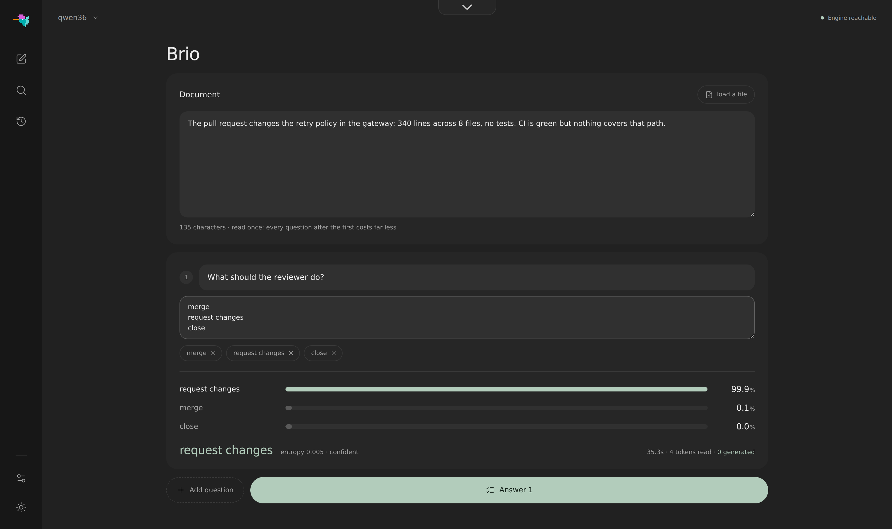
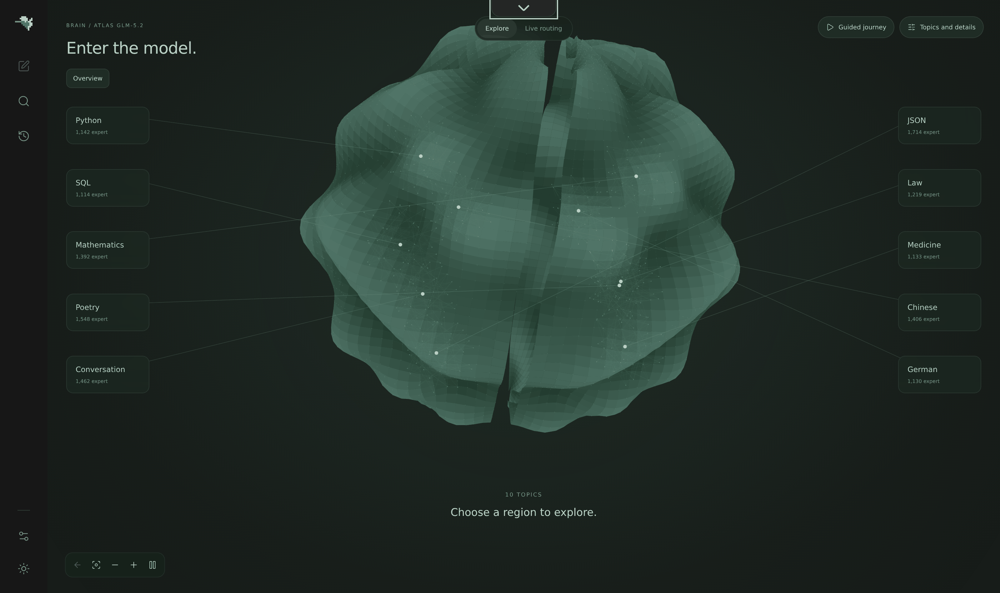

<p align="center">
  
</p>

<p align="center">
  <a href="https://justvugg.github.io/colibri"></a>
  <a href="https://github.com/JustVugg/colibri/releases"></a>
</p>

<p align="center">
  <a href="https://justvugg.github.io/colibri"><b>网站</b></a> ·
  <a href="https://discord.gg/RXV83nSZdk"><b>Discord</b></a> ·
  <a href="README.md">English</a> · 简体中文 · <a href="README.zh-TW.md">繁體中文</a> · <a href="README.it.md">Italiano</a> · <a href="README.ja.md">日本語</a> · <a href="README.id.md">Bahasa Indonesia</a>
</p>

**小巧引擎，庞大模型。** colibri 在你现有的机器上运行超大规模的开放模型。一个拥有数千亿参数的专家混合（mixture-of-experts，MoE）模型，每个 token 只会用到自身的一小部分，因此 colibri 把这一部分放在内存中，其余部分，也就是各个专家，则在模型需要时从磁盘读取。纯 C 实现，每个模型家族一个文件，不需要 GPU。

目前有十三个引擎可以运行。其中十个用于语言模型：**GLM-5.2/5.3**、**GLM-5.3-Flash**、**Inkling**、**Kimi K3**、**DeepSeek V4 Flash**、**DeepSeek V4.1 Flash**、**MiMo-V2.6 Flash**（以及 Pro）、**Qwen3.8-Flash-Next**、**Qwen3.6**（它也能运行 Qwen3-Coder 和稠密的 Qwen3.8-27B）以及 **OLMoE**。一个用于生成图片：**Qwen-Image-2.1**。两个用于回答决策问题：**Laya** 和 **GLiNER2.5-Decide**，第三个决策模型 **Clef** 运行在 Qwen3.6 引擎上。[我的机器适合哪一个](#which-model-for-my-machine)

```
$ ./coli chat
  colibri v2.0.0 · GLM-5.2 · 744B MoE · int4 · streaming CPU
  ✓ ready in 32s · resident 9.9 GB
  › ciao!
  ◆ Ciao! Come posso aiutarti oggi?
```

<a id="get-started"></a>
<a id="the-one-step-way"></a>

## 一步开始使用

你需要一台内存至少 **8 GB** 的电脑（16 GB 或更多更好），磁盘上要有 **22 GB 可用空间**来放最小的模型，还需要网络连接。显卡是可选的。

**Windows**

1. 在本页面点击 **Code**，再点击 **Download ZIP**，然后解压。
2. 在解压后的文件夹中双击 **`START-HERE.bat`**。如果电脑上没有 Python，它会提出帮你安装。

**Linux**（Ubuntu 和 Debian；其他发行版也有同样的软件包，只是名称不同）

```bash
sudo apt install git python3 build-essential
git clone https://github.com/JustVugg/colibri
cd colibri
./start-here.sh
```

**macOS**（需要 [Homebrew](https://brew.sh)）

```bash
xcode-select --install
brew install libomp git python
git clone https://github.com/JustVugg/colibri
cd colibri
./start-here.sh
```

你只需要回答一个问题：用哪个模型，直接按回车就采用推荐。然后安装程序会：

1. **检查你的机器**：内存、磁盘可用空间、CPU 和 GPU；
2. **推荐一个装得下的模型**：模型中始终留在内存里的部分，加上最小的专家缓存，必须放得进你的内存，下载的文件必须放得进你的磁盘；
3. **获取引擎**：如果机器上有编译器，就为你的机器编译引擎，否则下载预编译版本，该版本在 CPU 上运行，在 Linux 和 Windows 上也能在 Vulkan GPU 上运行。在值得的时候，它会为你的 GPU 编译：Linux 上的 NVIDIA 显卡在装有 CUDA toolkit 时用 CUDA，否则用 Vulkan。在独立显卡上总是这样做；集成显卡与 CPU 共用内存，只有实测在集成显卡上更快的模型（Qwen3.6、Qwen3-Coder 和 Qwen3.8-Flash-Next）才会这样做。如果缺少某个软件包，它会打印出安装该软件包的确切命令，并继续使用 CPU；之后再运行一次安装程序，它就会为 GPU 重新编译；
4. **下载模型**，显示进度并支持断点续传：随时可以中断，再次运行就会从中断的地方继续；
5. **启动 colibri，并在浏览器中打开仪表盘**，同时打印出其他应用可以使用的地址：

```
Starting colibri
  Browser:             http://127.0.0.1:8000/
  OpenAI base URL:     http://127.0.0.1:8000/v1
  Anthropic base URL:  http://127.0.0.1:8000
  stop: press Ctrl+C here (or close this window)
```

**下次使用时**，再次运行 `START-HERE.bat` 或 `./start-here.sh` 即可：colibri 会直接启动，不再下载，也不再编译。`c/coli status` 显示安装了什么以及它是否在运行，`c/coli stop` 用来停止它（Windows 上为 `c\coli.cmd status` 和 `c\coli.cmd stop`）。

选项写在 `./start-here.sh` 或 `START-HERE.bat` 后面：

| 选项 | 作用 |
|---|---|
| `--list` | 列出所有模型与这台机器的对照，以及某个模型为什么装不下 |
| `--model ID` | 安装指定的模型（id 见[下面的表格](#which-model-for-my-machine)） |
| `--yes` | 不提问：直接采用推荐 |
| `--dir DIR` | 把模型放到另一块磁盘上（默认 `~/colibri-models`） |
| `--backend vulkan`、`cuda` 或 `cpu` | 自己选择引擎的构建版本；`--no-gpu` 等同于 `--backend cpu` |
| `--model-dir DIR` | 使用你已经下载好的模型 |
| `--reconfigure` | 换一个模型 |

每一步的详细说明：[docs/quickstart.md](docs/quickstart.md#the-one-step-way)。

### 如果出了问题

| 你看到的情况 | 怎么办 |
|---|---|
| 下载过程中停止了 | 再次运行同一条命令：它会从磁盘上已有的字节处继续 |
| `to use the GPU through ..., first run: <command>` | 运行这条命令，然后再运行一次安装程序：它会为 GPU 重新编译，不会重新下载 |
| `the ... build failed`，例如已安装的 CUDA toolkit 不再支持这张显卡时出现的 `Unsupported gpu architecture` | 安装程序会先把 toolkit 和显卡对照检查，自行选择 Vulkan，并说明原因；如果编译仍然失败，它会提供下一个选项（先 Vulkan，再 CPU）。`./start-here.sh --backend vulkan` 强制使用 Vulkan；`--no-gpu` 则只使用 CPU |
| `needs N GB free for the download` | 用 `--dir` 指定一个更大磁盘上的文件夹 |
| 在 WSL 中，模型文件夹位于 `/mnt/c` 下 | 把它放在 Linux 磁盘上（即默认的 `~/colibri-models`）：`/mnt/c` 要慢很多倍 |
| 更新了代码（`git pull`） | 重新运行 `./start-here.sh`：如果源代码有变化，它会先重新编译引擎，再启动 |
| 其他情况 | `c/coli logs -n 50` 显示后台启动的服务器的日志（前台启动的服务器输出在它自己的终端里），`c/coli logs --install` 显示安装程序的日志；提交一个 [issue](https://github.com/JustVugg/colibri/issues)，附上安装程序最后打印的几行 |

### 让 AI 助手帮你安装

如果你在用 AI 编程助手，它可以替你完成以上所有步骤。这样告诉它：

> 按照 https://github.com/JustVugg/colibri 中的 docs/AI_SETUP.md，在这台机器上安装 colibri

[docs/AI_SETUP.md](docs/AI_SETUP.md) 把每一步都写成一条命令，并给出机器可读的结果，还要求助手在下载模型或安装系统软件包之前先征求你的同意。支持 Model Context Protocol 的助手也可以改用 colibri 的 MCP 服务器：`coli mcp` 提供检测硬件、推荐模型、安装、启动、停止和检查的工具（[docs/MCP_SERVER.md](docs/MCP_SERVER.md)）。

### 或者手动安装

如果想自己决定每一步（用预编译的发布版还是从源码编译，从下面的表格中选哪个模型，然后用 `coli chat`、`coli web` 还是 `coli serve`），请看[手动安装](#install-by-hand)，或者查看按平台逐步说明的 [Quick Start 指南](docs/quickstart.md)。

## colibri 是什么，为什么做它

专家混合模型在磁盘上很大，但每个 token 用到的部分很小。GLM-5.2 有 744B 参数，每个 token 用到约 40B，而其中在 token 之间会变化的只有约 11 GB：也就是被路由到的专家。

<p align="center">
  
</p>

所以模型不必完整装进高速内存，而是需要被正确地**放置**。稠密部分（注意力、共享专家、嵌入）留在内存中。路由专家留在磁盘上，在路由器需要时读取，中间经过一个缓存，它会学习你的工作用到哪些专家。如果有 GPU，它会保存最热的专家和稠密层。权重放在哪里，只改变回答出来的速度，不改变由哪些权重、哪些路由决策产生这个回答。

为什么做它：为了在人们已有的硬件上运行这种规模的模型，为了看着它们工作（仪表盘会显示每一个被激活的专家），也为了让引擎保持足够小，让任何人都能测量它、把它变得更快。colibri 也是一个开放的研究平台：一项优化要靠可复现的端到端测量才能被采纳，默认策略绝不会在不告知的情况下改变模型精度或路由语义。高速内存少了，可以慢一些；但不能悄悄地重新定义模型。详见[工作原理](#how-it-works)。

<a id="which-model-for-my-machine"></a>

## 我的机器适合哪个模型

安装程序会推荐能在你的机器上完全从内存运行的最强模型，并在它下面列出从磁盘流式读取的更大模型。`./start-here.sh --list` 会把所有模型与你的机器逐一对照。下面的表格与安装程序自己的目录（[`c/setup_catalog.py`](c/setup_catalog.py)）一致；下载大小是 Hugging Face 为每个仓库列出的大小。

- **内存**一栏是两个数字：低于第一个数字时模型无法启动，达到第二个数字时，它的运行速度与实测一致。
- **GPU** 一栏是安装程序能为该引擎编译的 GPU 版本（[GPU](#gpus)）。*含集成显卡*表示它也会使用集成显卡，这些引擎在集成显卡上实测更快；其他引擎只使用独立显卡。
- **实测**一栏是在所注明的机器上计时得到的结果，对聊天模型而言是解码速度。字母代表表格下方列出的机器。空白表示还没有人测过。

**小模型，完全在内存中运行**

| 模型 | `--model` | 下载大小 | 内存 | GPU | 实测 |
|---|---|---|---|---|---|
| **Qwen3.6-35B-A3B**：聊天，支持思考和工具调用 | `qwen36-35b` | 23 GB | 10 / 20 GB | CUDA、Vulkan（含集成显卡） | CPU 上 6.0 tok/s，在集成显卡上用 Vulkan 9.9（A）；用 CUDA 30.0（C） |
| Qwen3-Coder-30B-A3B：写代码和工具调用，不带思考 | `qwen3-coder-30b` | 19 GB | 8 / 18 GB | CUDA、Vulkan（含集成显卡） | 全部专家都在内存中时 8.5-9.6 tok/s，每层 32 个时 5.1（A，CPU） |
| **Qwen-Image-2.1**：文生图，非商业许可 | `qwen-image-2.1` | 33 GB | 12 / 18 GB | Vulkan | 一张 768x512 的图片用时 2 分 40 秒（8 个 Zen 4 核心，CPU） |

**大模型，专家从磁盘流式读取**（速度由磁盘决定：快速的 NVMe 硬盘帮助最大）

| 模型 | `--model` | 下载大小 | 内存 | GPU | 实测 |
|---|---|---|---|---|---|
| DeepSeek V4 Flash REAP 150B：保留 256 个专家中的 132 个 | `deepseek-v4-flash-reap` | 85 GB | 16 / 32 GB | CUDA、Vulkan | |
| **DeepSeek V4 Flash**（284B）：工具调用 | `deepseek-v4-flash` | 167 GB | 16 / 32 GB | CUDA、Vulkan | 32 GB 时 0.93 tok/s（Ryzen 7 5800X），63 GB 时 1.24（Ryzen 9 5950X），仅用 CPU；用 CUDA 1.5-1.6（RTX 5080，32 GB，两块 NVMe） |
| **MiMo-V2.6 Flash**（309B）：视觉和工具调用 | `mimo-v2.6-flash` | 172 GB | 32 / 52 GB | Vulkan | 2.34-3.37 tok/s（A，CPU） |
| **Qwen3.8-Flash-Next**（125B + 51B n-gram）：视觉和工具调用 | `qwen38-flash-next` | 186 GB | 24 / 32 GB | CUDA、Vulkan（含集成显卡） | 每层 32-96 个专家时 1.91-2.56 tok/s；使用可选的 int4 专家时 3.99（A，CPU） |
| **GLM-5.2**（744B）：参考模型，带 MTP head | `glm-5.2` | 429 GB | 16 / 24 GB | CUDA、Vulkan | 25 GB 笔记本上冷启动 0.05-0.1 tok/s；128 GB 的 Ryzen AI Max+ 395 上 1.83；6x RTX 5090 上 9.0-9.2 |
| GLM-5.3（744B）：同一个引擎，没有 MTP head | `glm-5.3` | 419 GB | 16 / 24 GB | CUDA、Vulkan | |
| **Inkling**（975B）：int4 专家，bf16 稠密权重 | `inkling` | 514 GB | 按下载格式为 120 / 128 GB；经过[稠密部分转换](docs/inkling.md)后为 25 GB | CUDA、Vulkan | 0.25 tok/s（Ryzen 9 7900，187 GB，RTX A6000） |
| MiMo-V2.6 Pro（1.02T）：视觉和工具调用 | `mimo-v2.6-pro` | 564 GB | 54 / 64 GB | Vulkan | 0.66-0.79 tok/s（A，CPU） |
| **Kimi K3**（2.8T）：最大的模型 | `kimi-k3` | 1.56 TB | 32 / 64 GB | CUDA、Vulkan | 每个 token 约 9.4 秒，专家读取速度为 6.3 GB/s |

<a id="other-supported-models"></a>

**手动安装：下载后还需要一步转换或准备**

| 模型 | 下载大小，以及之后在磁盘上的大小 | 内存 | GPU | 实测 |
|---|---|---|---|---|
| **OLMoE**（7B）：小模型，适合用来熟悉工具 | 14 GB，转换为 int8 后为 7 GB | 8 GB | Vulkan | 22-23 tok/s（A，CPU） |
| Qwen3.8-27B（稠密）：文本和图像 | 56 GB，转换后为 51 GB | int4 时 20 GB，int8 时 30 GB | Vulkan | int4 时 3.45 tok/s，int8 时 2.1（16 线程 CPU 服务器） |
| **GLM-5.3-Flash**（321B）：视觉和工具调用 | 328 GB，逐个 shard 转换为 195 GB | 25 GB | CUDA、Vulkan | 热缓存时每个 token 约 20 秒，冷启动 44 秒（6 核心，25 GB，普通磁盘） |
| **DeepSeek V4.1 Flash**（552B）：视觉和工具调用，无需转换，但需要一次性准备 | 510 GB | 约 18 GB，再加上专家缓存（每层 8 个时峰值 24.8 GB） | Vulkan | 0.21-0.24 tok/s（16 线程 CPU 服务器，容纳 68% 的专家） |

**决策模型**（它们回答 [System One](#system-one-a-decision-with-a-probability) 问题，不用于聊天）

| 模型 | 下载大小，以及之后在磁盘上的大小 | 内存 | GPU | 实测 |
|---|---|---|---|---|
| **Laya**（Convai Innovations），英语 | 0.85 GB | 1.7 GB | CPU | 一个问题 219 ms，三个问题 882 ms（B） |
| **GLiNER2.5-Decide**（fastino），英语 | 1.95 GB | 1.9 GB | CPU | 一个问题 294 ms，三个问题 897 ms（B，有负载时） |
| **Clef**（Cloudflare）：带决策头的 Qwen3.8-27B，也能聊天 | 55 GB，转换后为 52 GB | 从 int4 的 19 GB 到 f16 的 55 GB | CPU | int8 时每个请求 20.4 秒（A） |

机器：**A** 是一台 Ryzen 7 PRO 8700GE 台式机（8 核心，61-64 GB DDR5，NVMe，集成显卡 Radeon 780M）；**B** 是一台 i7-1355U 笔记本；**C** 是 Threadripper 3945WX 主机中的一张 RTX 3070 8 GB，稠密层和 DeltaNet 层都放在显卡上（per-row int4 容器）。每个数字都来自 [docs/](docs/) 中对应模型的页面或[基准测试表格](docs/benchmarks.md)，其中写明了确切的设置。

每个家族都有自己的页面：[qwen36.md](docs/qwen36.md)（Qwen3.6、Qwen3-Coder、Qwen3.8-27B）、[qwen38.md](docs/qwen38.md)、[deepseek-v4.md](docs/deepseek-v4.md)、[deepseek-v41.md](docs/deepseek-v41.md)、[mimo.md](docs/mimo.md)、[glm53-flash.md](docs/glm53-flash.md)、[inkling.md](docs/inkling.md)、[kimi_k3.md](docs/kimi_k3.md)、[qwen-image.md](docs/qwen-image.md)、[laya.md](docs/laya.md)、[gliner_decide.md](docs/gliner_decide.md)、[clef.md](docs/clef.md)，GLM-5.2 则见 [Quick Start](docs/quickstart.md#3-get-the-model)。与已支持模型架构相同的 checkpoint，例如运行在 Qwen3.6 引擎上的 KAT-Coder v2.5，无需任何修改即可运行。

<a id="gpus"></a>

## GPU

### 不需要 GPU

每个引擎都能在 CPU 上运行，无需安装任何其他东西。GPU 只是一个存放权重的更快的地方，而不是必要条件：大模型的速度由磁盘决定，小模型的速度由内存决定。

### Vulkan：任意 GPU

每个 MoE 引擎都能以两种方式使用任何具有 Vulkan 1.2 驱动的 GPU（AMD、Intel、NVIDIA，集成显卡或独立显卡均可）：

- **专家层级**：GPU 显存中的一个路由专家缓存，启动时根据你过去对话用到的专家来填充，并在你聊天的过程中不断调整。GPU 计算它所持有的专家，同时 CPU 计算其余的专家；
- **稠密链**：把整个层记录为一次 GPU 提交，模型的运行状态从一层到下一层都保留在 GPU 上。

在机器 A 的集成显卡 Radeon 780M 上实测，每次运行前都把模型文件从页缓存中清除，解码 100 个 token（[vulkan.md](docs/vulkan.md#the-chain-on-a-radeon-780m)）：

| | CPU | Vulkan，专家层级 | Vulkan，专家层级加稠密链 |
|---|---|---|---|
| Qwen3.6-35B-A3B，解码 | 6.0 tok/s | 8.0 tok/s | **9.9 tok/s** |
| Qwen3.6-35B-A3B，512 个 token 的提示词 | 35.7 秒 | 12.2 秒 | **9.5 秒** |
| Qwen3.8-Flash-Next（int4 专家），解码 | 3.5 tok/s | **3.8 tok/s** | 3.2 tok/s |
| Qwen3.8-Flash-Next，512 个 token 的提示词 | 43.6 秒 | 38.7 秒 | **30.1 秒** |
| OLMoE，解码（热缓存） | **23.1 tok/s** | 12.8 tok/s | 17.3 tok/s |

集成显卡与 CPU 共用内存。它节省的是它所持有的那些专家的计算量和磁盘读取，因此在 Qwen3.6 这样的模型上有收益，而像 OLMoE 这样专家本来就在内存中的小模型，反而可能变慢。正因如此，安装程序只为 Qwen3.6、Qwen3-Coder 和 Qwen3.8-Flash-Next 在集成显卡上开启 Vulkan，并且每个引擎自行决定是否在集成显卡上运行稠密链（Qwen3.6 会，Qwen3.8 不会）。`--backend vulkan` 则无论如何都会使用 Vulkan。

**开启或关闭 GPU。** `coli setup --backend vulkan` 对任何模型都使用 GPU，`coli setup --backend cpu`（或 `--no-gpu`）则全部在 CPU 上运行。用 Vulkan 编译的引擎只有在 `coli chat`、`serve` 或 `web` 的环境中有 `COLI_VULKAN=1` 时才使用 GPU（安装程序选择 Vulkan 时会自动设置）；没有它，引擎就在 CPU 上运行。GPU 开启时，`COLI_VK_CHAIN=0` 保留专家层 (tier)，让稠密层在 CPU 上运行。在集成显卡上，两种都试一试：在一台 Intel Iris Xe（Core i7-1355U）笔记本上，Qwen3.6 在 CPU 上解码 2.1 tok/s，用 Vulkan 为 1.7 到 1.9，关闭稠密链后为 2.1。

在独立显卡上，安装程序会为每个引擎编译 Vulkan 版本（如果引擎有 CUDA 路径且装有 toolkit，则优先使用 CUDA），并把稠密层放在显卡上。这正是该设计所针对的情形。**我们自己还没有实测过独立显卡。**第一份数据来自一位用户：Qwen3.6 在 Tesla V100 16 GB 上，配合专家层级和稠密链，解码速度为 17 到 19 tok/s（[#1852](https://github.com/JustVugg/colibri/issues/1852)）。（在它们之前，GLM-5.2 较早的 Vulkan 路径在独立显卡 RX 9070 上的解码速度为 1.7-1.8 tok/s。）欢迎提供你的显卡上的数据。

**没有 Resizable BAR 的显卡**现在也能用了。这类显卡（所有 Turing 显卡、使用首发固件的 Ampere 显卡、关闭了该选项的较旧 AMD 显卡）只允许 CPU 直接写入其显存中约 256 MB 的部分；colibri 现在会自动通过一个暂存缓冲区（staging buffer）把权重复制进去。这条路径已通过强制启用以及在三种设备上模拟小窗口进行了测试，在 780M 上没有可测量的开销；尚未在真正没有 Resizable BAR 的显卡上实测（[vulkan.md](docs/vulkan.md#memory-placement-without-resizable-bar)）。

CI 在软件驱动上将每个引擎的 Vulkan 路径与 CPU 的 token 对照检查。GPU 做加法的顺序不同，而且在 CPU 会舍入的地方把部分激活值保留为 f32，因此较长的回答可能与 CPU 的回答相差一个词（[vulkan.md](docs/vulkan.md#the-other-engines)）。

### CUDA：NVIDIA 显卡

在 Linux 上，如果装有 CUDA toolkit，安装程序会为具有 CUDA 路径的引擎编译 CUDA 版本：GLM-5.2/5.3、GLM-5.3-Flash、Inkling、Kimi K3、DeepSeek V4 Flash、Qwen3.8-Flash-Next，以及 Qwen3.6 和 Qwen3-Coder。在 Windows 上，CUDA 引擎是一个单独的 DLL（[windows.md](docs/windows.md)），每个版本都附带编译好的版本：`colibri-<版本>-windows-x86_64-cuda.zip` 包含 `coli_cuda.dll`（适用于计算能力 8.0 及以上的显卡）以及加载它的 colibri、qwen36 和 kimi_k3 引擎。把它解压到主压缩包之上，安装程序就会选择 CUDA。

- **显存专家层级**把最热的专家放在显卡上，这些专家根据实测路由选出；未命中的专家同时在 CPU 上计算。Qwen3.6 在两张 8 GB 显卡（RTX 3070 和 Quadro RTX 4000）上、有热的路由历史时，解码速度为 11.3 tok/s（[qwen36-cuda-tier.md](docs/qwen36-cuda-tier.md)）；GLM-5.2 在六张 RTX 5090 上、全部专家常驻时为 9.0-9.2 tok/s（[benchmarks.md](docs/benchmarks.md)）；DeepSeek V4 Flash 在一张 RTX 5080 上为 1.5-1.6 tok/s，3,324 个 token 的提示词用时 90 秒（[deepseek-v4.md](docs/deepseek-v4.md)）。
- **Qwen3.6 新功能：DeltaNet 层放在显卡上**（`Q36_DN_GPU=1`，需手动开启）。以前，Qwen3.6 的 30 个 DeltaNet 层中，每一层对每个 token 都要在显卡和 CPU 之间复制四次数据；现在，解码一个 token 时整个层都在显卡上运行，其循环状态保留在显存中。在 RTX 3070 上、稠密层位于显存时：从 25.4 提升到 30.0 tok/s（[qwen36-cuda-tier.md](docs/qwen36-cuda-tier.md#the-deltanet-layer-on-the-card-q36_dn_gpu1)）。
- **较旧的显卡。** 如果 CUDA toolkit 已不再支持为你的显卡编译（例如 CUDA 13 与 V100，见 [#1852](https://github.com/JustVugg/colibri/issues/1852)），安装程序会在编译之前就发现这一点，并说明原因，转而通过 Vulkan 使用这张显卡；装上 CUDA 12.x toolkit 可以恢复 CUDA 路径。DeepSeek V4 的 CUDA 层级也可以为 Pascal 和 Turing 编译（`CUDA_ARCH=portable-pre-ampere NO_TC=1`）。

全部内容：[docs/cuda.md](docs/cuda.md)。

### Apple Silicon

Metal 后端为多个引擎在统一内存 GPU 上执行专家运算（[docs/metal.md](docs/metal.md)）。版本的 macOS 压缩包中，`colibri`、`inkling` 和 `kimi_k3` 已带 Metal 编译：`COLI_METAL=1`（Kimi K3 用 `K3_METAL=1`）开启它，不设置时在 CPU 上运行。从源码编译请用 `METAL=1`；一步安装程序编译的是 CPU 版本。

<a id="system-one-mode-ask-a-closed-question"></a>
<a id="system-one-a-decision-with-a-probability"></a>

## System One：一个带概率的决策

人们向模型提出的请求，大多数是要它做一个选择，而不是写一段文字：哪个队列、哪个结论、是或否。`POST /v1/systemone` 接收一个状态（文本或 JSON）和若干带类型的问题，对每个问题给出每个允许选项的概率以及一个置信度。不生成任何内容，因此答案不可能落在你的列表之外，而“模型没有把握”就成了一个可以设阈值的数字。

```bash
curl -s http://127.0.0.1:8000/v1/systemone -H 'Content-Type: application/json' -d '{
  "state": "340 lines, 8 files, no tests. CI is green but nothing covers that path.",
  "questions": {
    "review": {"type": "choice", "instructions": "What should the reviewer do?",
               "criteria": {"merge": null, "request changes": null, "close": null}},
    "risky":  {"type": "noul", "instructions": "Is this change risky?"}}}'
```

`choice` 类型的问题返回所选的标签、每个标签的概率，以及一个从 0（毫无倾向）到 1（完全确定）的 `confidence`；`noul` 返回“是”的概率；`score` 返回期望等级。

由谁来回答：

- **colibri 运行的任何聊天模型**，通过打分：它读出每个选项的概率，而不是写出一个答案。关于同一文档的多个问题只读取文档一次：在 Qwen3.6 上，关于同一文档的四个问题，比在同一台 CPU 机器上生成同样的答案快 5.7 倍。
- **三个决策模型**，原生作答，一次前向传播完成，使用其作者拟合的校准：[Laya](docs/laya.md)（Convai Innovations）、[GLiNER2.5-Decide](docs/gliner_decide.md)（fastino）和 [Clef](docs/clef.md)（Cloudflare；它也能聊天）。它们的大小和速度见[决策模型表格](#which-model-for-my-machine)。

**从 Jev 切换过来。** 请求和回复与 TypeSafe 的 Jev API 相同，因此 Jev 客户端只需更改 base URL 即可切换到 colibri，其他什么都不用改：`TYPESAFE_BASE_URL=http://127.0.0.1:8000`（没有设置 `COLI_API_KEY` 就启动的服务器会接受客户端已经在发送的密钥）。两个官方 SDK 未经任何修改，已针对 `coli serve` 测试。

同样的模式也可以在终端中使用（`coli chat` 中的 `/decide merge | request changes | close`），也可以在仪表盘的 System One 页面使用。完整的请求与回复、打分规则，以及它在哪些情况下帮不上忙：[docs/systemone.md](docs/systemone.md)。

## 仪表盘

`coli web` 会打开它，一步安装程序也会：包括聊天、System One 页面、大脑（Brain）页面和性能剖析（Profiling）页面，支持浅色和深色主题。

<p align="center">
  
</p>
<p align="center"><em>Qwen3.6 在 CPU 机器上作答，专家从磁盘流式读取。</em></p>

<p align="center">
  
</p>
<p align="center"><em><strong>System One</strong>：给模型一份文档，以及它唯一可以选择的几个答案。图中：<strong>request changes 的概率为 99.9%</strong>，熵 0.005，读取 4 个 token，生成 0 个。</em></p>

<p align="center">
  
</p>
<p align="center"><em><strong>大脑（Brain）</strong>：GLM-5.2 的<a href="https://github.com/JustVugg/colibri/issues/175">实测专家图谱</a>，13,260 个已分析的专家分布在十个区域（Python、SQL、数学、诗歌、法律、中文……），位置取决于实测的路由亲和度。<strong>Live routing</strong> 显示正在运行的模型：每个专家一格，颜色表示存储层级，一轮中每个被路由到的专家都会闪烁。</em></p>

**性能剖析**（Profiling）页面按阶段显示每一轮的时间花在了哪里，并以最近 30 轮作为趋势。

## 在其他应用中使用

`coli serve`（安装程序会替你启动它）是一个同时提供多种 API 的服务器：

- **兼容 OpenAI**：`/v1/chat/completions`、`/v1/completions` 和 `/v1/models`，支持流式输出、JSON 回复、停止序列和 logprobs；
- **兼容 Anthropic**：`/v1/messages`，因此 Claude Code 和 Anthropic SDK 可以直接连接它；
- **工具调用**：除 Inkling 和 OLMoE 之外的每个聊天引擎都支持，各自使用其模型的原生格式（[各引擎对照表](docs/api.md#tool-calling-support)）；
- **图像输入**：GLM-5.3-Flash、DeepSeek V4.1 Flash、MiMo-V2.6、Qwen3.8-Flash-Next 和 Qwen3.8-27B 支持，方式可以是 `coli chat` 消息中的一个路径、`coli web` 中的一个附件，或一个 `image_url` 部分；
- **图像输出**：Qwen-Image-2.1 通过 `POST /v1/images/generations` 提供，`coli chat` 还能直接在终端中显示图片（[qwen-image.md](docs/qwen-image.md)）；
- **决策**：通过 `POST /v1/systemone`（[见上文](#system-one-a-decision-with-a-probability)）。
- **同时进行多个对话**：在每个文本引擎上，`coli serve --kv-slots N` 最多保留 16 个对话，每个都有自己的缓存，并把它们的下一个 token 一起解码（[api.md](docs/api.md#isolated-kv-contexts)）。

编程 CLI 和编辑器的连接方式与连接任何兼容 OpenAI 的服务商相同：base URL 为 `http://127.0.0.1:8000/v1`，模型 id 用 `coli status` 打印出的那个，密钥任意非空即可（[docs/api.md](docs/api.md#connect-a-coding-cli-or-editor)）。

<a id="how-it-works"></a>

## 工作原理

<p align="center">
  
</p>

每个 token 的每一层都走相同的五个步骤：路由、并集、放置、重叠、学习。设计目标是**放置只决定速度**：无论专家是从显存、内存还是磁盘作答，路由器的决策和权重的精度都完全相同。

<p align="center">
  
</p>

- **权重的 JIT。** 编译器的 JIT 从不编译整个程序：它观察实际运行的部分，只编译热点路径。colibri 对权重下了同样的赌注。实测的路由热度决定哪些专家配得上显存、内存或磁盘：一个逐层的 LRU 缓存，加上一个从你自己的对话中学到的固定热门集合（`.coli_usage`，每轮更新）。colibri 越用越快。之所以可行，是因为路由具有可测量的结构（见[专家图谱](https://github.com/JustVugg/colibri/issues/175)）。
- **绝不为磁盘等待两次。** 一个专家的三个矩阵用一次 `pread` 读出；一组加载线程在常驻专家计算的同时读取缺失的专家；一批位置对每个专家只读取一次；路由前瞻线程可以预取下一层（GLM-5.2 的路由提前一层时有 71.6% 可预测）。`DIRECT=1`（O_DIRECT）在快速 NVMe 硬盘上往往收益很大，在其他硬盘上则持平甚至更差：请在你自己的硬盘上实测（[tuning.md](docs/tuning.md)）。
- **不止一块 SSD。** `COLI_MODEL_MIRROR=/second/glm52_i4 ./coli chat --model /fast/glm52_i4` 会同时从第二块硬盘上的副本读取。两块接在独立控制器上的 NVMe 硬盘实测解码速度 +37.5%；放在较小硬盘上的部分镜像也可以（[multidisk.md](docs/multidisk.md)）。
- **从笔记本到机架。** 在 25 GB 的笔记本上，所有专家都从磁盘流式读取，慢，但结果正确；在大型主机上，所有专家都常驻（`CUDA_EXPERT_GB=auto PIN_GB=all`），磁盘完全退出解码过程。`COLI_NUMA=1` 把常驻权重分布到多路主机的各个内存控制器上，本地集群模式则可以在其他机器上运行路由专家（[cluster.md](docs/cluster.md)）。
- **忠实的模型。** 每个引擎都在 CI 中用一个微型 fixture 与其模型的参考实现进行对照检查。GLM-5.2 的 MLA 注意力保存压缩后的 KV 状态（每个 token 576 个浮点数，而不是 32,768 个，缩小 57 倍），并且在重启后依然保留，因此重新打开对话时无需再次读取提示词。
- **物有所值的推测解码。** GLM-5.2 的 int8 MTP head 在划算时每次前向传播起草 2.2-2.8 个 token；Qwen3.8-Flash-Next 的 MTP head 默认开启，在输出不变的情况下提速 16-20%；提示词查找在代码编辑上提速 6-7%。在起草成本高于节省的地方（DeepSeek V4），它保持关闭（[tuning.md](docs/tuning.md#speculation-and-reproducibility)）。

引擎是每个模型家族一个 C 文件（GLM-5.2 是 `c/colibri.c`），建立在共享的头文件之上，运行时不需要 BLAS，也不需要 Python：Python 只用于安装程序、启动器、转换工具和 API gateway。

<a id="what-it-achieves"></a>

## 基准测试

<p align="center">
  
</p>

同一个引擎，同一个 int4 容器：硬件只改变专家存放的位置。GLM-5.2 的解码速度，摘自[完整表格](docs/benchmarks.md)：

- **6x RTX 5090，全部专家常驻：** 5.8-6.8 tok/s，使用选择性 NUMA 交错时为 9.0-9.2（[实验记录](docs/experiments/glm52-6x5090-2026-07-12.md)）；
- **128 GB，仅用 CPU**（Ryzen AI Max+ 395）：热缓存时 1.83 tok/s（[#200](https://github.com/JustVugg/colibri/issues/200)）；
- **一台配单张 RTX 5070 Ti 的笔记本级主机：** 1.07 tok/s（[#273](https://github.com/JustVugg/colibri/issues/273)）；
- **项目起步时的那台 25 GB 笔记本：** 冷启动 0.05-0.1 tok/s，这是诚实的下限。

质量靠测量，而不是靠假设：int4 容器的代价和量化消融实验见 [benchmarks.md](docs/benchmarks.md#quality-benchmark)。想加入你的机器，请按照[基准测试协议](docs/benchmarking.md)操作，并提交一个附有数据的 issue。

<a id="install-by-hand"></a>

## 手动安装

<a id="1-get-colibri"></a>

**1. 程序。** 从 [Releases](https://github.com/JustVugg/colibri/releases) 下载对应平台的压缩包（Linux x86_64、macOS、Windows；不需要编译器，只需要供启动器和 API 使用的 [Python 3](https://www.python.org/downloads/)）并解压，然后运行 `python3 coli info`。Linux 和 Windows 的引擎内置 Vulkan（`shaders/` 就在旁边），macOS 的引擎内置 Metal；在 Windows 上使用 NVIDIA 显卡时，再加上 CUDA 压缩包。或者用 `gcc`（或 clang）和 OpenMP 从源码编译：

```bash
git clone https://github.com/JustVugg/colibri && cd colibri/c
./setup.sh                                # checks gcc/OpenMP, builds, self-tests
make qwen36 VK=1                          # one engine, here with Vulkan (CUDA=1 for CUDA)
```

<a id="2-get-the-model"></a>

**2. 模型。** [上面表格](#which-model-for-my-machine)中的任何一个下载都可以：安装程序的 id 对应 Hugging Face 仓库，每个模型的页面都写有下载和转换命令。GLM-5.2 请使用带 int8 MTP head 的 group-scaled（gs64）容器 [`mastouri/GLM-5.2-colibri-int4-g64-with-int8-mtp`](https://huggingface.co/mastouri/GLM-5.2-colibri-int4-g64-with-int8-mtp)（429 GB），GLM-5.3 则使用 [`Justvugg/GLM-5.3-colibri-int4-g64`](https://huggingface.co/Justvugg/GLM-5.3-colibri-int4-g64)（419 GB，没有 MTP head）。不要使用较旧的 per-row int4 镜像：它们的质量实测低约 9 个百分点，并导致了 [#455](https://github.com/JustVugg/colibri/issues/455) 中的循环回答。`./coli convert --model /nvme/glm52_i4` 会从 FP8 发布版逐个 shard 构建同样的容器，任何时候都不需要在磁盘上同时存放全部 756 GB。如何检查 MTP head 以及其他事项：[quickstart.md](docs/quickstart.md#3-get-the-model)。

<a id="3-run-it"></a>

**3. 运行。** 在源码 checkout 的 `c/` 目录中，或在解压后的发布包中运行。启动器会读取模型的 `config.json`，选出对应的引擎及其聊天模板，因此所有模型的命令都相同：

```bash
./coli chat  --model /nvme/qwen36          # chat in the terminal
./coli web   --model /nvme/qwen36          # API + dashboard, opens a browser
./coli serve --model /nvme/qwen36          # API + dashboard, no browser
./coli plan  --model /nvme/qwen36          # where the model will live: VRAM, RAM, disk
./coli doctor --model /nvme/qwen36         # read-only check: is everything ready?
./coli tune  --model /nvme/qwen36          # measure and save this machine's fastest safe settings
```

在 Windows 上，发布包附带 `coli.cmd`（`coli.cmd chat --model D:\qwen36`）；在源码 checkout 中请使用 `py -3 c\coli`。`.exe` 文件是引擎，而不是启动器。所有选项和变量：[SETTINGS.md](docs/SETTINGS.md)、[ENVIRONMENT.md](docs/ENVIRONMENT.md)。

## 研究，以及如何参与

colibri 希望前沿模型更少依赖稀缺硬件，运行成本更低。这意味着改变权重的存储和移动方式，决定哪些内容放在显存、内存或存储中，让 CPU 和 GPU 的工作相互重叠，并测试新的解码方法。没有什么会因为是惯例就被保留，也没有什么会因为微基准测试看起来快就被采用：起决定作用的是真实机器上的端到端推理，并且质量与速度一起测量。当前的开放问题：

| 假设 | 目前的证据 | 仍需完成的实验 |
|---|---|---|
| 路由历史能比普通 LRU 更好地放置专家 | 学习到的固定集合能改善重复负载，但可能对某个提示词过拟合 | 在编程、聊天、多语言和长上下文负载上做留出集、跨会话的 A/B |
| 多块 SSD 能把独立的带宽转化为解码速度 | 两块独立的 NVMe 硬盘实测解码 +37.5%；经加权条带化后，较慢的第三块硬盘影响持平（[测量数据](docs/multidisk.md#what-has-been-measured)） | 在不同的硬盘速度、控制器布局和缓存状态下复现 |
| 硬件感知的规划器能自动接近每台机器的最佳配置 | 目前已能检测内存/显存预算和多个后端，安装程序也会选择构建版本 | 在笔记本、工作站、NUMA 主机和多 GPU 系统上，把生成的方案与受控的参数扫描进行对比 |
| 无损或质量受控的表示能把权重搬运量减少到有意义的程度 | 已有格式和量化消融实验，并设有正确性/质量门槛 | 同时复现质量、搬运的字节数、延迟和每个有效 token 的成本，而不只看压缩率 |
| 感知路由的推测解码能在接近全驻留之前就带来收益 | MTP 和语法草稿可用，但 MTP 在专家命中率约 85% 时也实测过 32% 的损失 | 绘制接受率、专家命中率、批次并集和草稿深度之间的盈亏平衡面 |
| CPU/GPU 重叠能隐藏传输和同步开销，而不只是转移瓶颈 | CUDA、Metal 和 Vulkan 都有收益数据，但快速 CPU、集成显卡和低驻留率可能把收益抹平 | 在 PCIe、统一内存和全驻留机器上做逐阶段 profile 和单变量 A/B，并取得 Vulkan 层级和稠密链在独立显卡上的首批数据 |

想参与？任选一行，负面结果也请公开。记录硬件、commit、模型、完整命令、提示词、缓存状态、吞吐量、首 token 延迟、专家命中率、读取的字节数，以及一项质量检查；每次只改变一个变量，重复运行，并附上原始日志。先从 [CONTRIBUTING.md](CONTRIBUTING.md) 和[基准测试协议](docs/benchmarking.md)开始，然后[提交一个 issue](https://github.com/JustVugg/colibri/issues/new)。在这里，一个控制良好的失败比一个无法解释的高速数字更有价值。

## 文档

| 主题 | 文档 |
|---|---|
| 一步安装与手动安装，所有平台 | [quickstart.md](docs/quickstart.md) |
| 通过 AI 助手安装，以及 MCP 服务器 | [AI_SETUP.md](docs/AI_SETUP.md)、[MCP_SERVER.md](docs/MCP_SERVER.md) |
| API：OpenAI、Anthropic、工具调用、KV slot、仪表盘 | [api.md](docs/api.md) |
| System One 与决策模型 | [systemone.md](docs/systemone.md)、[laya.md](docs/laya.md)、[gliner_decide.md](docs/gliner_decide.md)、[clef.md](docs/clef.md) |
| Vulkan：专家层级、稠密链、没有 Resizable BAR 的显卡 | [vulkan.md](docs/vulkan.md) |
| CUDA，以及 Qwen3.6 的 CUDA 层级 | [cuda.md](docs/cuda.md)、[qwen36-cuda-tier.md](docs/qwen36-cuda-tier.md) |
| Apple Silicon、Windows | [metal.md](docs/metal.md)、[windows.md](docs/windows.md) |
| 调优、学习型缓存、预取、推测解码 | [tuning.md](docs/tuning.md) |
| 多块 SSD、多台机器 | [multidisk.md](docs/multidisk.md)、[cluster.md](docs/cluster.md) |
| 基准测试以及如何测量 | [benchmarks.md](docs/benchmarks.md)、[benchmarking.md](docs/benchmarking.md) |
| 所有选项和环境变量 | [SETTINGS.md](docs/SETTINGS.md)、[ENVIRONMENT.md](docs/ENVIRONMENT.md) |
| 语法强制草稿，以及实验性的嵌入 ABI | [grammar-draft.md](docs/grammar-draft.md)、[segment-runtime.md](docs/segment-runtime.md)、[edge-runtime.md](docs/edge-runtime.md) |

## 仓库结构

```
start-here.sh, START-HERE.bat   the one-step setup (Linux and macOS, Windows)
Makefile                        root build/check entry point
c/
├── colibri.c             GLM-5.2/5.3 engine  (make glm)
├── glm53.c               GLM-5.3-Flash  (make glm53)
├── inkling.c             Inkling  (make inkling)
├── kimi_k3.c             Kimi K3  (make kimi_k3)
├── deepseek_v4.c         DeepSeek V4 Flash  (make deepseek-v4)
├── deepseek_v41.c        DeepSeek V4.1 Flash  (make deepseek_v41)
├── mimo.c                MiMo-V2.6 Flash and Pro  (make mimo)
├── qwen38.c              Qwen3.8-Flash-Next  (make qwen38)
├── qwen36.c              Qwen3.6, Qwen3-Coder, Qwen3.8-27B, Clef  (make qwen36)
├── olmoe.c               OLMoE  (make olmoe)
├── qwenimage.c           Qwen-Image-2.1  (make qwenimage)
├── laya.c                Laya  (make laya)
├── gliner_decide.c       GLiNER2.5-Decide  (make gliner_decide)
│
├── st.h, quant.h, idot.h        safetensors reads, container decoders, integer kernels
├── expert_ffn.h, expert_store.h routed-expert kernel and streaming expert cache
├── tok.h, json.h, compat.h      tokenizer, JSON, Windows/macOS shims
├── route_trace.h, kv_prefix.h   routing telemetry (.coli_usage), KV prefix reuse
├── decide_serve.h               the decision engines' side of System One
│
├── backend_cuda.*        optional CUDA tier   (CUDA=1)
├── backend_metal.*       optional Metal tier  (METAL=1)
├── backend_vulkan.*, vk_tier.c, vk_chain.c   optional Vulkan tier and dense chain (VK=1)
│
├── coli                  user-facing CLI
├── setup_*.py            the one-step setup: hardware, catalog, downloads, flow
├── mcp_server.py         the MCP server (coli mcp)
├── openai_server.py      OpenAI- and Anthropic-compatible HTTP gateway
├── resource_plan.py      RAM/VRAM planner behind coli plan and coli doctor
├── tools/                conversion, fixtures and benchmarks
└── tests/                dependency-free C and Python tests
web/                      the dashboard (a pure API client)
desktop/                  Tauri desktop shell around the dashboard
docker/                   container images
docs/                     reference docs, experiments, media
site/                     the website
```

**每个模型家族一个 `.c`，建立在共享的单头文件之上。** 一个引擎只负责自己的架构，其他一概不管；两个引擎都需要的东西放在它们共同包含的头文件里，这样一个修复能同时覆盖所有引擎。在仓库根目录下，`make`、`make check` 和 `make clean` 都会转交给引擎的 Makefile。

## 支持项目

colibri 最初是一个人在一台 12 核心、25 GB 内存的笔记本上开发的项目；如今它的数据来自社区中的各种真实机器。如果它对你有用：

- 为仓库加星并分享它；
- 提交附有你的硬件基准测试数据的 issue：数据点比任何其他东西都更能推动这个项目；
- 加入 [Discord 社区](https://discord.gg/RXV83nSZdk)，讨论实验、硬件结果和研究方向；
- 如果想赞助开发或捐赠硬件，请通过 GitHub issues 联系。

## 为什么叫“colibrì”

蜂鸟只有几克重，能在原地悬停，一天要造访上千朵花。这个引擎靠蜂鸟般的口粮让一个 744B 参数的巨人运转起来：25 GB 内存、十二个 CPU 核心，以及对磁盘的大量耐心。

## 致谢

colibri 只是一个引擎；它运行的智慧是一份馈赠。感谢以开放方式发布权重的团队：**Z.ai**（GLM）、**Moonshot AI**（Kimi）、**Alibaba Qwen**、**DeepSeek**、**Xiaomi**（MiMo）、**Thinking Machines**（Inkling）、**Allen AI**（OLMoE）、**Convai Innovations**（Laya）、**fastino**（GLiNER2.5-Decide）和 **Cloudflare**（Clef）；感谢发布转换后容器的人；也感谢每一位做过基准测试、二分定位问题、复现图谱运行或提交补丁的贡献者。本仓库中的第三方代码及其许可证：[THIRD_PARTY_NOTICES.md](THIRD_PARTY_NOTICES.md)。

本项目在专家放置、压缩与路由方面的实验，也建立在以下开放研究与系统工作的思路和证据之上：

- [REAP](https://github.com/CerebrasResearch/reap) 与
  [EASY-EP](https://github.com/RUCAIBox/EASYEP)：输出感知的与特定领域的专家重要性。
- [SERE](https://github.com/JL-Cheng/SERE)：基于相似度的专家重路由；
  [ReMoE](https://github.com/BUAA-OSCAR/ReMoE)：感知缓存局部性的路由器微调。
- [MC-SMoE](https://github.com/UNITES-Lab/MC-SMoE)：路由引导的专家合并与压缩。
- [MoBE](https://github.com/inclusionAI/MoBE) 与
  [D²-MoE](https://github.com/lliai/D2MoE)：共享专家基与低秩专家增量。
- [HybriMoE](https://github.com/PKU-SEC-Lab/HybriMoE)：CPU/GPU 混合专家调度；
  [ScMoE](https://arxiv.org/abs/2404.05019)：专家通信与计算的重叠；
  [OD-MoE](https://arxiv.org/abs/2512.03927)：分布式按需专家加载。
- [vLLM](https://github.com/vllm-project/vllm)、
  [llama.cpp](https://github.com/ggml-org/llama.cpp) 与
  [kTransformers](https://github.com/kvcache-ai/ktransformers)：开放的推理系统与专家卸载工作，
  使对比得以复现。

引擎也建立在具体的工程成果之上，而不只是思路。以下每一项如今都在代码树中被使用或重新实现：

- [safetensors](https://github.com/huggingface/safetensors)：每个引擎读取的容器格式
  （`c/st.h`），包括其 fp8 与 I64 数据类型。
- [tiktoken](https://github.com/openai/tiktoken)：`c/tok.h` 精确地重新实现了它的
  `byte_pair_encode`，合并拼接后词表 id 最小的相邻对，因此源自 tiktoken 的词表不需要 merges 列表。
- [llama.cpp](https://github.com/ggml-org/llama.cpp)：`c/grammar.h` 中的 GBNF 语法子集遵循它的
  语法与 set-of-stacks PDA，Metal 路径也借用了它的 `newBufferWithBytesNoCopy` 常驻技巧。
- [vLLM](https://github.com/vllm-project/vllm)：引擎逐位置对齐的输出语义参考（例如最终 norm
  相对于 LM head 的位置）。
- [transformers](https://github.com/huggingface/transformers)：oracle；CI 以它为基准逐 token
  复现一个随机初始化的模型。
- [DietGPU](https://github.com/facebookresearch/dietgpu)：实验性压缩专家层级（`COLI_ANS`）背后的
  GPU ANS 编解码器。
- [rocWMMA](https://github.com/ROCm/rocWMMA)：HIP 后端把 CUDA 的 `nvcuda::wmma`
  fragment/mma_sync API 映射到它之上（`c/backend_gpu_compat.h`），这让同一份 .cu 源码可以为
  两家厂商编译。

## 许可证

Apache 2.0，Copyright 2026 Vincenzo Fornaro。详见 [LICENSE](LICENSE) 与 [NOTICE](NOTICE)。每个模型保留其作者给出的许可证（GLM-5.2 权重由 Z.ai 以 MIT 许可发布；Qwen-Image-2.1 仅限非商业用途）。
