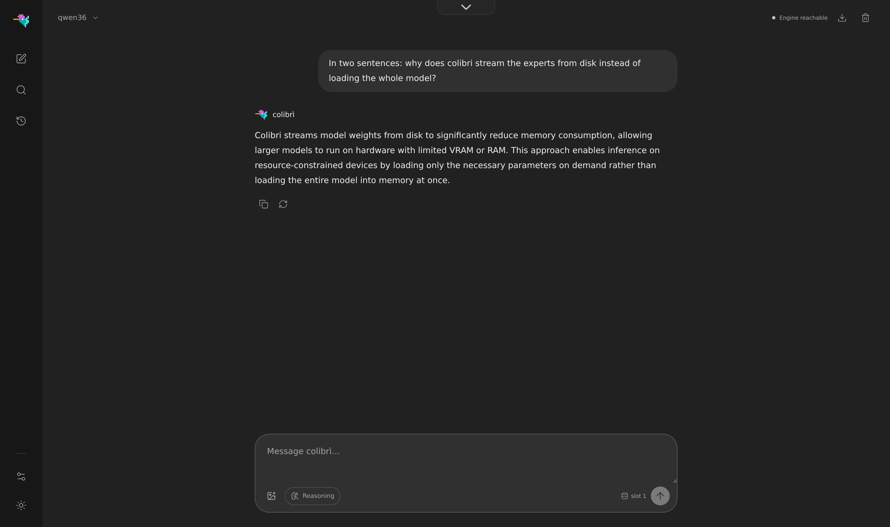
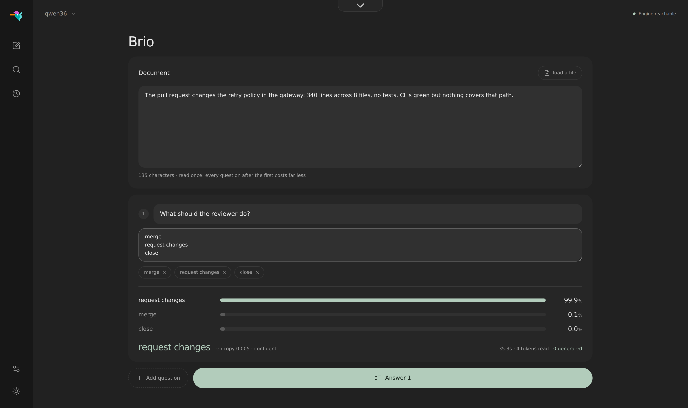
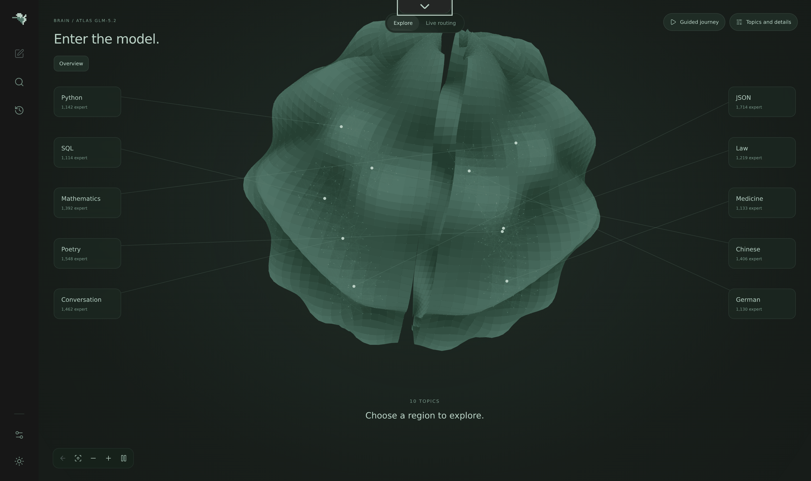
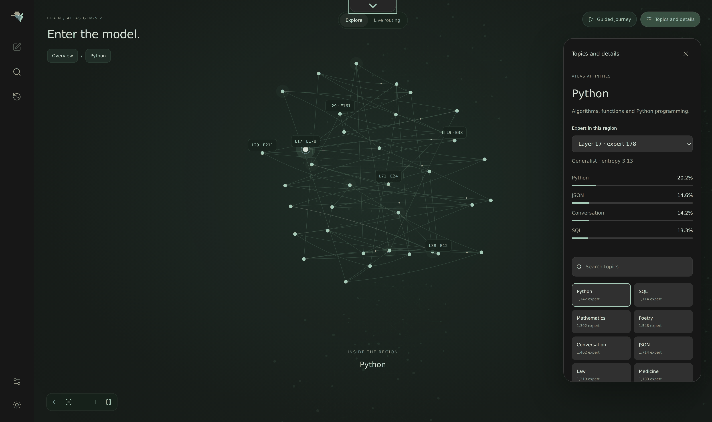

<p align="center">
  
</p>

<p align="center">
  <a href="https://discord.gg/RXV83nSZdk"><b>Discord</b></a> ·
  <a href="README.md">English</a> · <a href="README.zh-CN.md">简体中文</a> · 繁體中文 · <a href="README.it.md">Italiano</a> · <a href="README.ja.md">日本語</a>
</p>

**小巧引擎，龐大模型。**在消費級與異質硬體上執行**前沿 MoE 模型——從 744B 到
2.8T 參數**——以引擎零相依套件的純 C 實作，將儲存、RAM 與 VRAM 視為統一的推論階層。

目前可執行九個模型家族：**GLM-5.2/5.3**（744B）、**GLM-5.3-Flash**（321B，含視覺）、
**Inkling**（975B）、**Kimi K3**（2.8T）、**DeepSeek V4 Flash**（284B）、**DeepSeek V4.1 Flash**（552B，含視覺）、
**Qwen3.8-Flash-Next**（125B + 51B n-gram）、**Qwen3.6**（35B-A3B）與 **OLMoE**（7B）
——各自一個 C 檔案，共用同一套 `coli chat` / `coli serve` / `coli web` 前端。[完整清單](README.md#other-supported-models)

> **Colibrì 既是今天就能執行的推論引擎，也是一個開放的研究平台。**它的首要目標是在
> 完整的軟硬體邊界上追求推論側效能——模型格式、記憶體階層、儲存 I/O、配置、排程、核心、
> 推測解碼以及 CPU/GPU 重疊執行——讓大型模型減少對稀缺硬體的依賴，並降低執行成本。

Colibrì 刻意用於驗證激進的系統構想——因此**對速度不作 SLA 承諾，對語意則給出硬性保證**：
實驗必須透過可重現的端到端測量證明價值；預設策略**絕不會在未告知的情況下改變模型精度或
路由語意**。高速記憶體不足可以降低速度，但不能悄悄重新定義模型。

```
$ ./coli chat
  🐦 colibri v1.12.1 — GLM-5.2 · 744B MoE · int4 · streaming CPU
  ✓ ready in 32s · resident 9.9 GB
  › ciao!
  ◆ Ciao! 😊 Come posso aiutarti oggi?
```

## 實際運行畫面

<p align="center">
  
</p>
<p align="center"><em>網頁儀表板（<code>./coli web</code>），1.12.0 重新設計：一個工作區，底部停靠列切換聊天、Brio 模式、
Brain 頁面和效能分析，支援淺色與深色主題。圖中是 Qwen3.6 在純 CPU 機器上作答，專家從硬碟串流讀取。</em></p>

<p align="center">
  
</p>
<p align="center"><em><strong>Brio 模式</strong>：同一個模型，只是不再讓它寫。給它一段文件和唯一允許的幾個答案，
它讀出每個答案的機率，不生成任何 token，並給出一個熵，說明它何時沒有把握。圖中：<strong>request changes，99.9%</strong>，
熵 0.005，讀取 4 個 token，生成 0 個。</em></p>

<p align="center">
  
</p>
<p align="center"><em><strong>大腦（Brain）</strong>頁面的 <strong>Explore</strong> 檢視：將 GLM-5.2 的<a href="https://github.com/JustVugg/colibri/issues/175">實測專家圖譜</a>繪成一塊皮質。
13,260 個已分析專家分為十個區域（Python、SQL、數學、詩歌、法律、中文……）；位置取自實測路由親和度，而非學習出的嵌入向量。
選擇一個區域即可進入。<strong>Live routing</strong> 檢視切換到正在執行的模型：每個專家一格，顏色代表儲存層級，每輪被路由到的專家都會閃白。</em></p>

<p align="center">
  
</p>
<p align="center"><em><strong>Python</strong> 區域內部：1,142 個專家組成的星座，每個都標註了層號和序號。面板顯示其中一個：第 17 層第 178 號專家，
一個熵為 3.13 的通才，其實測親和度為 Python 20.2%、JSON 14.6%、對話 14.2%、SQL 13.3%。</em></p>

<p align="center">
  
</p>
<p align="center"><em><strong>效能剖析（Profiling）</strong>頁面：引擎在每一輪中的時間去向，按階段劃分，並以最近 30 輪作為趨勢。
此處為 CPU 機器上的 Qwen3.6：36 個提示詞元與 55 個生成詞元共用時 19.0 秒，2.9 tok/s，其中 11.4 秒的磁碟服務與計算重疊。</em></p>

## 研究使命

前沿模型推論不該預設要求資料中心級硬體。Colibrì 的研究目標很簡單：
**最佳化證據顯示受限的每一段推論路徑，降低推論的硬體依賴與總成本**。

這包括改變權重的表示與移動方式，決定哪些內容常駐 VRAM、RAM 或儲存，重疊異質運算，
降低啟動與同步開銷，利用稀疏性與重用，並驗證新的解碼演算法。傳統做法不是免責理由，
微基準快也不是採用理由；最終依據是在真實機器上的端到端推論，同時測量正確性、品質、
吞吐、延遲、記憶體與成本。

它最終帶來的是可及性：在既有硬體上執行 744B 模型，即時觀察每個專家，並直接修改實作。
不是從 API 租用智慧，而是持有、探測、測量和改進它。引擎刻意維持足夠小，讓任何願意測量
的人都可能貢獻下一項有效最佳化。

## 核心技術與實測結論

- **統一階層，而非單一記憶體門檻。**VRAM、RAM 與 NVMe 是同一份權重的不同配置階層；
  高速記憶體不足只影響速度，不改變模型語意。
- **權重的 JIT。**實測路由熱度驅動逐層 LRU、學習型熱門專家固定區和提前一層的預先載入，
  無需載入所有專家。它在可重複負載上有收益，但歷史可能過度擬合，預先載入在部分主機上
  也可能負最佳化，因此它們是需要測量的策略，不是效能承諾。
- **I/O 本身就是引擎的一部分。**專家批次聯集、讀算重疊、`O_DIRECT` 與加權雙 SSD
  分流直接最佳化串流路徑，而不是假裝儲存延遲不存在。`O_DIRECT` 取決於磁碟，雙 SSD
  仍需要更多社群端到端 A/B。
- **異質執行。**CPU、CUDA、Metal、NUMA 記憶體以及專家的部分或全部常駐共用一個執行環境，
  可依機器條件組合；最佳組合取決於算力、頻寬、常駐率與負載。
- **壓縮狀態，不竄改模型。**逐 token 精確的前向驗證、縮小 57 倍的 MLA KV 狀態、
  持久化熱會話與忠實 DSA，讓最佳化始終受正確性約束。這些是記憶體、延遲和正確性屬性，
  不是籠統的吞吐承諾。
- **必須證明收益的推測解碼。**原生 MTP 與文法強制草稿均接受端到端測量；
  接受率無法覆蓋驗證成本時可以關閉。

## 開放猜想、實驗與參與方式

在受控的端到端 A/B 證明之前，Colibrì 將每項最佳化都視為猜想。目前主要問題如下：

| 猜想 | 目前證據 | 仍需完成的實驗 |
|---|---|---|
| 路由歷史能比普通 LRU 更好地配置專家 | 學習型固定區能改善重複負載，但也會對 prompt 過度擬合 | 在程式碼、對話、多語言和長上下文負載上做留出集、跨會話 A/B |
| 多顆 SSD 能將獨立頻寬轉化為解碼速度 | 加權鏡像／分片路由已實作並通過驗證，頻寬模型成立 | 在獨立控制器的真實磁碟上做冷快取、單碟與雙碟 GLM-5.2 對照 |
| 硬體感知規劃器能自動接近每台機器的最佳配置 | 目前已偵測 RAM/VRAM 預算與多個後端 | 將自動方案與參數掃描對比，涵蓋筆電、工作站、NUMA 和多 GPU 主機 |
| 無損或品質受控的表示能充分減少權重搬運 | 已有格式與量化消融，並設置正確性／品質門檻 | 同時重現品質、搬運位元組、延遲和每個有效 token 成本，而非只看壓縮率 |
| 路由感知推測能在接近全常駐前獲利 | MTP 與文法草稿可用，但 MTP 在約 85% expert hit 時也實測過 -32% | 繪製接受率、命中率、批次聯集與草稿深度的盈虧邊界 |
| CPU/GPU 重疊能隱藏傳輸與同步，而非僅轉移瓶頸 | CUDA 與 Metal 有成功數據，但強 CPU 和低常駐率會抹平收益 | 在 PCIe、統一記憶體與全常駐機器上做逐階段 profile 和單變數 A/B |

想參與就任選一行，負結果也請公開。請記錄硬體、commit、模型容器、完整指令、prompt、
快取狀態、吞吐、TTFT、expert hit、讀取位元組數與品質檢查；每次只改一個變數，重複執行並附上
原始日誌。先閱讀 [CONTRIBUTING.md](CONTRIBUTING.md) 和
[benchmark 協議](docs/benchmarks.md)，然後
[建立實驗 issue](https://github.com/JustVugg/colibri/issues/new)。
在這裡，一個受控的失敗比一個無法解釋的高數字更有價值。

## 核心概念

744B 的專家混合（Mixture-of-Experts）模型，每個 token 只會啟用約 40B 參數——
其中每個 token 之間會變動的只有約 11 GB（被路由到的專家）：

<p align="center">
  
</p>

所以模型不必完整**放進**高速記憶體，而是需要正確**配置位置**：

- **稠密部分**（注意力、共享專家、嵌入——約 17B 參數）以 int4
  **常駐 RAM**（約 9.9 GB）；
- **19,456 個路由專家**（75 個 MoE 層 × 256，加上 MTP head；每個在 int4 下約 19 MB）
  **存放在硬碟**（約 370 GB），並**隨需串流載入**，搭配逐層 LRU 快取、
  會學習的熱門專家固定儲存區，以及選用的 VRAM 層級。

引擎由主 C 檔（`c/colibri.c`）與多個標頭檔模組組成。不需要 BLAS，
執行階段不需要 Python，也不需要 GPU。

## 運作方式

### 每個 token 的處理路徑

<p align="center">
  
</p>

每個 token 的每一層都會走過相同的五個步驟。設計目標是讓
**配置只決定速度**——無論專家是從 VRAM 或硬碟回應，路由器的決策與權重精度都完全相同。

### 統一記憶體階層，取代單一記憶體門檻

<p align="center">
  
</p>

同一套引擎涵蓋完整硬體範圍：在 25 GB 筆電上，一切都從硬碟串流載入
（慢，但結果正確）；在大型主機上，則可讓整組專家常駐
（`CUDA_EXPERT_GB=auto PIN_GB=all`），讓硬碟完全退出解碼路徑。
兩端之間有一層**學習型快取**：引擎會記錄*你的*工作負載路由到哪些專家
（`.coli_usage`，每輪更新），並自動固定最熱門的專家——colibrì 確實會越用越快。
在多插槽主機上，`COLI_NUMA=1` 會將常駐權重交錯分配到各記憶體控制器
（[#82](https://github.com/JustVugg/colibri/issues/82)）。

### 絕不為同一次硬碟讀取等待兩遍

快取未命中的成本很高，因此引擎大部分的巧思都用來避免或重疊處理這些讀取：
每個專家的三個矩陣相鄰儲存，並以一次 `pread` 讀取；有界非同步 I/O pool
（`PIPE=1`，預設啟用）會在常駐專家運算時載入缺少的專家；批次位置只讀取每個
不重複專家一次（**批次聯集**）；路由前瞻執行緒（`PILOT=1`）則預先載入下一層專家——
實測顯示，路由結果提前一層時有 **71.6% 的可預測性**。
在 GPU 上，常駐管線（`COLI_CUDA_PIPE=2`）讓殘差流跨層保留在裝置端，
使 CPU 專家迴圈不中斷；在 Apple Silicon 上，實驗性的
[Metal 後端](docs/metal.md)會用統一記憶體 GPU 執行批次專家運算。

### 忠實模型，壓縮狀態

前向傳遞已透過 `transformers` oracle 驗證（teacher-forcing 通常為
30-32/32；tiny oracle 中有兩個位置是浮點數近似平手，結果會受工具鏈影響）。
MLA 注意力儲存壓縮後的 KV 狀態——每個 token 為 576 個浮點數，而非 32,768 個
（**縮小 57×**）——並跨重新啟動持久保存
（`.coli_kv`）：對話可暖啟恢復，不需重新 prefill，結果與不中斷的工作階段
逐位元組相同。DSA 稀疏注意力（GLM-5.2 的 lightning indexer）已忠實實作，
並透過強制選取所有 key，驗證可精確重現稠密注意力。

### 如實呈現推測式解碼

GLM-5.2 原生 MTP head 會起草 token，再由主模型以一次批次前向傳遞驗證——
條件合適時每次 forward 可產生 2.2–2.8 個 token。兩條得來不易的規則已成為預設值：
MTP head 必須是 **int8**（int4 head 的接受率會崩落到 0–4%，見
[#8](https://github.com/JustVugg/colibri/issues/8)），且草稿與驗證必須計算
**相同函數**——`SPEC_PIN=1` 會把兩者固定在同一 kernel family
（完整鑑識過程見 [#163](https://github.com/JustVugg/colibri/issues/163)）。
文法強制草稿（[`GRAMMAR=file.gbnf`](docs/grammar-draft.md)）可在受限 JSON 輸出中，
以近乎免費的成本提高接受率。推測式解碼是否帶來淨收益取決於快取熱度——請實測，
若不划算就使用 `DRAFT=0`。

## 實際成果

<p align="center">
  
</p>

同一套引擎、同一個 int4 容器——硬體只會改變專家的存放位置。
[完整 benchmark 表格](docs/benchmarks.md)中的重點如下：

- **6× RTX 5090，全部常駐：**解碼 5.8–6.8 tok/s，TTFT 約 13 秒
  （[實驗紀錄](docs/experiments/glm52-6x5090-2026-07-12.md)）；
- **128 GB、僅使用 CPU 的桌上型電腦：**暖機後約 1.8 tok/s
  （[#200](https://github.com/JustVugg/colibri/issues/200)）；
- **單張 RTX 5070 Ti 的筆電級電腦：**透過 GPU 常駐管線達到 1.07 tok/s
  （[#273](https://github.com/JustVugg/colibri/issues/273)）；
- **25 GB 開發機：**冷啟動 0.05–0.1 tok/s——這是專案起步時已證實的下限，
  也仍是如實呈現的基準。

品質來自測量，而非假設：int4 容器的量化成本，以及 scale granularity／rotation
消融實驗，收錄於 [docs/benchmarks.md](docs/benchmarks.md#quality-benchmark)、
[#108](https://github.com/JustVugg/colibri/issues/108) 與
[#81](https://github.com/JustVugg/colibri/issues/81)。

## 開始使用

你需要兩樣東西：**程式本體**（幾百 KB）與**模型**（372 GB）。各平台的逐步
指引請見 [Quick Start 指南](docs/quickstart.md)。

### 1. 取得 colibri

**下載預先建置的版本**——Linux、macOS 與 Windows 均已提供，不需要編譯器。從
[Releases](https://github.com/JustVugg/colibri/releases) 下載對應平台的壓縮檔並解壓：

```bash
mkdir colibri && tar xzf colibri-v1.8.0-linux-x86_64.tar.gz -C colibri && cd colibri
python3 coli info                         # engine ready ✓
```

裡面包含引擎（`colibri`，Windows 上為 `colibri.exe`）、`coli` 啟動器及其 Python
輔助腳本。不需重新命名或設定：`coli` 會自動找到同目錄下的引擎。你只需安裝
[Python 3](https://www.python.org/downloads/)——啟動器與 API gateway 是 Python
腳本，而引擎本身是零相依的純 C 程式。

**或者從原始碼建置**——需要具備 OpenMP 的 `gcc`（或 clang）：

```bash
git clone https://github.com/JustVugg/colibri && cd colibri/c
./setup.sh                                # 檢查 gcc/OpenMP、建置並執行自我測試
```

想把 `coli` 加入 PATH？在 checkout 中執行 `pip install -e .` 即可註冊（引擎仍位於
`c/` 目錄——這是從複製目錄做的可編輯安裝，而非獨立 wheel）。

### 2. 取得模型

Hugging Face 上已有預先轉換的 **GLM-5.2 int4** 容器——請務必使用
**含 int8 MTP head 的 group-scaled（gs64）版本**。它約為 **372 GB**，請放在空間足夠的硬碟上，最好是快碟：

**https://huggingface.co/mastouri/GLM-5.2-colibri-int4-g64-with-int8-mtp**

**GLM-5.3** 屬於同一家族,使用同一引擎載入。它有自己的 group-scaled(gs64)容器,
約 **419 GB**,且**不含** MTP head,因此推測解碼保持關閉:

**https://huggingface.co/Justvugg/GLM-5.3-colibri-int4-g64**

> ⚠️ 請使用上面的 **gs64** 容器，不要使用較舊的 per-row int4 鏡像
>（`mateogrgic/…`、`jlnsrk/…`）：後者品質實測低約 9 個百分點，也是
> [#455](https://github.com/JustVugg/colibri/issues/455) 最初 think-mode 迴圈與生成不終止的根因。
> gs64 修復了受控的 per-row A/B 問題，但不是通用的重複或 EOS starvation 防護。
> MTP head 也必須是 **int8，而非 int4**（int4 的草稿接受率為 0%，
> [#8](https://github.com/JustVugg/colibri/issues/8)）：
> `ls -l <model>/out-mtp-*`——正確的 int8 大小為 `3527131672 / 5366238584 / 1065950496`。

你也可以自行從 FP8 來源轉換——只需一條可續傳的指令，且任何時候都不需要
在硬碟上同時存放完整的 756 GB：

```bash
./coli convert --model /nvme/glm52_i4     # 逐 shard 下載並轉換（僅此一次需要 python）
```

### 3. 執行

```bash
COLI_MODEL=/nvme/glm52_i4 ./coli chat     # 自動偵測 RAM 預算、快取與 MTP
COLI_MODEL=/nvme/glm52_i4 ./coli plan     # 檢視規劃的 VRAM／RAM／硬碟配置
COLI_MODEL=/nvme/glm52_i4 ./coli doctor   # 唯讀就緒檢查
./coli web  --model /nvme/glm52_i4        # 在同一個連接埠提供 API 與網頁儀表板
./coli serve --model /nvme/glm52_i4       # 僅提供 OpenAI 相容 API
```

#### Brio 模式：問一個封閉式問題

人們向模型提出的大多數請求是一次選擇，而不是一段文字：哪個佇列、哪個結論、某個欄位應取四個值中的哪一個。
Brio 模式把允許的選項交給引擎，讀出每個選項的機率，而不是生成文字：`completion_tokens` 为 0，
答案不可能落在你的清單之外，並且每個答案都附帶一個熵，"模型沒有把握"因此成為一個可以設門檻的數字。
它在全部九個模型家族上可用，執行在同一個伺服器上，且按請求可選：不請求它的聊天，輸出逐位元組保持不變。

```bash
# 在 TUI 中：同一個模型，只是不再讓它寫
./coli chat --model /nvme/qwen36_i4_gs64
> /brio merge | request changes | close
> 340 lines, 8 files, no tests. CI is green but nothing covers that path.

# 從任何程式：向執行中的伺服器傳送一個 JSON 請求
curl -s http://127.0.0.1:8000/v1/brio -H 'Content-Type: application/json' -d '{
  "model": "qwen36",
  "state": "340 lines, 8 files, no tests. CI is green but nothing covers that path.",
  "question": "What should the reviewer do?",
  "options": ["merge", "request changes", "close"]}'
```

`questions` 可以對只讀一次的文件提出多個問題；`schema` 逐欄位填充一個 JSON 物件，結構上必然合法。
在 Qwen3.6 上與在同一台 CPU 機器上生成同樣答案相比的實測：四欄位 schema 快 2.4 倍，
對同一文件的四個問題快 5.7 倍。完整說明、請求與回覆格式、以及它不適用的情形見 [docs/brio.md](docs/brio.md)。
儀表板中也有 Brio 頁面。


在 Windows 上同樣使用這些指令，寫作 `python coli chat --model D:\glm52_i4`。
引擎執行階段是純 C——python 只供單次轉換工具與選用的 API gateway 使用。

### 4. 深入了解

| 主題 | 文件 |
|---|---|
| Benchmark、社群實測數據、品質測量 | [docs/benchmarks.md](docs/benchmarks.md) |
| 調校選項、策略、學習型快取、預先載入 | [docs/tuning.md](docs/tuning.md) |
| Windows 11 原生建置（含 CUDA DLL） | [docs/windows.md](docs/windows.md) |
| CUDA 後端、VRAM 專家層級、全部常駐 | [docs/cuda.md](docs/cuda.md) |
| Apple Silicon Metal 後端 | [docs/metal.md](docs/metal.md) |
| OpenAI 相容 API、KV slots、網頁儀表板 | [docs/api.md](docs/api.md) |
| Brio 模式：對封閉的選項集評分而不是生成 | [docs/brio.md](docs/brio.md) |
| 文法強制草稿（結構化輸出） | [docs/grammar-draft.md](docs/grammar-draft.md) |
| 環境變數完整清單 | [docs/ENVIRONMENT.md](docs/ENVIRONMENT.md) |

## 下一步

- **推論系統研究就是產品。**目前階層採用 LRU 與學習型固定集；正在研究模型格式、壓縮、
  配置、排程、I/O、CPU/GPU 核心、異質重疊、KV 狀態與路由感知推測。目標是降低硬體要求
  和每個有效 token 的成本，所有成果都以端到端測量為準、經審查並公開開發。
- **支援更多開放模型。**階層演算法與模型無關，任何帶路由專家的 MoE 都能用相同方式分層。
  目前已有九個模型家族可用（GLM-5.2、GLM-5.3-Flash、Inkling、Kimi K3、DeepSeek V4 Flash、DeepSeek V4.1 Flash、
  Qwen3.8-Flash-Next、Qwen3.6、OLMoE）；更多開放權重家族（候選包括 **MiniMax**）將沿用同樣的
  規則獲得引擎支援：有人完成端到端實測之後。

## 支持專案

colibrì 最初是由一人使用 12 核心、25 GB RAM 的筆電開發；
如今它的數據來自社群中的各種真實機器。如果這個專案對你有用：

- ⭐ 為儲存庫加星並分享；
- 🐛 以 issue 提交你的硬體 benchmark 數據——實測資料比任何其他事都更能推動專案；
- 💬 加入 [Discord 社群](https://discord.gg/RXV83nSZdk)，討論實驗、硬體數據與研究方向；
- 💬 若想贊助開發或捐贈硬體，請透過 GitHub issues 聯絡。

## 儲存庫結構

```
Makefile                  根目錄建置／檢查入口
c/
├── colibri.c                 GLM 引擎主檔
├── quant.h                量化 matmul kernel
├── sample.h               取樣與 stop-set
├── kv_persist.h           .coli_kv 磁碟持久化
├── telemetry.h            儀表板協定、統計
├── st.h, tok.h, json.h   執行階段標頭檔
├── backend_cuda.*        選用的 CUDA 層級
├── Makefile              建置與本機檢查
├── coli                  使用者介面 CLI
├── openai_server.py      OpenAI 相容 HTTP gateway
├── setup.sh              單一指令完成本機設定
├── tools/                離線轉換、fixtures 與 benchmarks
├── scripts/              長時間轉換輔助工具
└── tests/                零相依套件的 C 與 Python 測試
web/                      瀏覽器 UI（純 OpenAI API client）
desktop/                  包裝網頁 UI 的 Tauri v2 桌面 shell
docs/                     參考文件、實驗與媒體檔
```

執行階段路徑刻意維持扁平、易讀：`colibri.c` 加上模組化標頭檔。
在儲存庫根目錄執行 `make`、`make check` 與 `make clean`，
都會轉交給引擎的 Makefile。

## 為什麼叫做「colibrì」

蜂鳥只有幾公克重，能在原地懸停，並在一天內造訪上千朵花。
這套引擎只用蜂鳥般的配給，就能讓 744B 參數的巨人運轉：
25 GB RAM、十二個 CPU 核心，以及對硬碟的大量耐心。

## 授權條款

Apache 2.0，Copyright 2026 Vincenzo Fornaro。詳見 [LICENSE](LICENSE) 與 [NOTICE](NOTICE)。GLM-5.2 權重由 Z.ai 以 MIT 授權發布。
