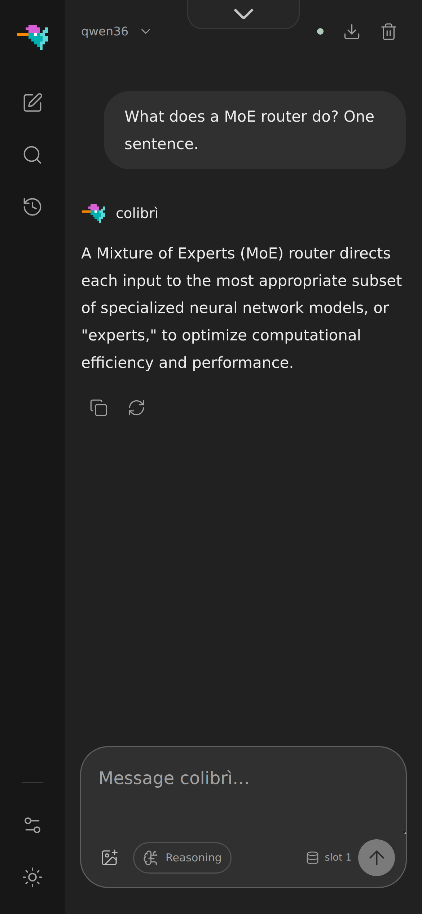
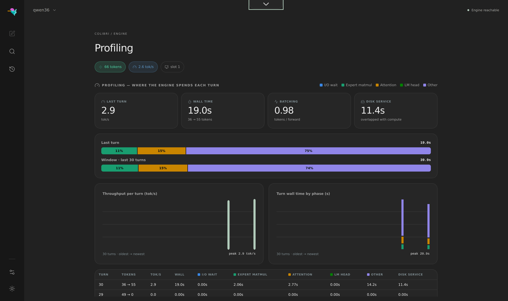

# OpenAI-compatible API, KV contexts & web UI

## `coli serve`

`coli serve` keeps one model process loaded and exposes a text-only
OpenAI-compatible HTTP API. The gateway uses only the Python standard library;
inference still runs in the same dependency-free C engine.

```bash
cd c
COLI_MODEL=/nvme/glm52_i4 COLI_API_KEY=local-secret ./coli serve \
  --host 127.0.0.1 --port 8000 --model-id glm-5.2-colibri

curl http://127.0.0.1:8000/v1/chat/completions \
  -H 'Authorization: Bearer local-secret' \
  -H 'Content-Type: application/json' \
  -d '{
    "model": "glm-5.2-colibri",
    "messages": [{"role": "user", "content": "Hello"}],
    "stream": true
  }'
```

Implemented endpoints are `GET /v1/models`, `GET /v1/models/{model}`,
`POST /v1/chat/completions`, legacy `POST /v1/completions`, `POST /v1/brio`
(closed-set scoring, [brio.md](brio.md)) and `POST /v1/systemone`, the
request and reply of TypeSafe's Jev API served by the same channel. Chat and
completion requests support JSON responses, SSE streaming, usage counts,
`max_tokens`/`max_completion_tokens`, `temperature`, `top_p`, and up to four
custom `stop` sequences. `max_tokens` is a ceiling, not a target: when the
prompt leaves less room than the budget asks for, every engine clamps the
budget to what the context holds and the reply ends with `finish_reason:
"length"`; only a prompt that does not fit is refused, with
`context_length_exceeded` (#260, #1641). Stop sequences are removed from the response and end
generation early in both JSON and streaming modes.

A trailing `assistant` message *continues* that turn instead of starting a new
one: the prompt ends inside it, which is the official template rendered with
`add_generation_prompt=False`. This is on by default — a message list ending in a
non-empty `assistant` turn continues, the same contract as Anthropic's API — and
there is no request field for it, because a trailing assistant turn already says
"continue me" and a body extension would only be reachable by hand-written JSON
rather than from the clients that want it. The server-side switch
`COLI_CONTINUE_ASSISTANT=0` restores the old behaviour (fold the turn into a
completed one and append a fresh cue). Continuation is refused together with
`tools`/`tool_calls`, because the tool-call parsers read an assistant turn from
its start, and the turn must carry text not ending in whitespace: the template
strips trailing whitespace, so the model would resume from different bytes than
the ones sent. A family whose renderer has no open-turn shape yet falls through
to the old behaviour rather than erroring — though every shipped family supports
continuation today, Kimi K3 included (its open turn is framed engine-side, in
`kimi_k3.c`, not derived in the gateway renderer).

A continuation resumes from the exact bytes you send, which makes the split
point part of the prompt. Splitting mid-word puts the model at a token boundary
it would not have produced itself, and the first generated token is conditioned
on that split: measured on GLM-5.3-Flash, `The capital of France is Par`
completes to `París`, not `Paris` — deterministically, across every effort level
and both endpoints. The continuation is real (the model finished the partial
word rather than restarting, which is the behaviour this feature exists for);
the spelling is an artefact of where the split fell. This is inherent to
resuming from an arbitrary byte offset rather than specific to this engine, and
it is the same hazard as the trailing whitespace above — in the one form that
cannot be refused, because splitting mid-word is sometimes exactly what the
caller wants. Split at a token-ish boundary when the spelling matters. The extension
`x_colibri_ignore_leading_stop: true` discards leading stop sequences until
the first non-whitespace response content, which is useful for local templates
that occasionally emit a role marker before the answer; strict OpenAI stop
behavior remains the default for client-provided sequences. GLM chat requests
with no client `stop` automatically use the template's `<|user|>` and
`<|observation|>` role markers, patiently ignoring only leading markers; this
prevents a model-completed turn from silently generating a new user or tool
turn. Inkling chat and legacy completion requests receive no implicit GLM stop
sequences. The extension
`enable_thinking: true` enables GLM-5.2's reasoning block; the standard
`reasoning_effort` field also enables it unless set to `none`.

The server serves one generation at a time: the model stays in one persistent
process, so concurrent HTTP requests queue instead of loading duplicate model
copies. Tool calling depends on the active engine; see the support matrix below.
Images, log probabilities, and token penalties return an explicit error rather
than being silently ignored. `seed` is accepted and ignored (see below).
Audio is accepted only by Inkling checkpoints with
audio support. The default bind address is localhost; set `COLI_API_KEY` before
exposing the server beyond the machine.

### `seed`

`seed` is accepted (not rejected) for OpenAI-API request-shape compatibility;
the value is not validated. This server sends no per-request seed on the
wire, so the value has no effect at any temperature.

### Tool-calling support

| Engine | OpenAI `tools` | Anthropic `tool_use` | Native format |
|---|---|---|---|
| GLM-5.2 (`colibri`) | yes | yes | `<tool_call>` blocks |
| DeepSeek V4 | yes | yes | native DSML tool-call blocks |
| Inkling | no | no | active tool declarations/choices return HTTP 400 |
| Kimi K3 | yes | yes | native XTML `tools`/`call`/`argument` blocks (#1143) |
| Qwen3.8-Flash-Next | no | no | active tool declarations/choices return HTTP 400 |
| OLMoE | no | no | active tool declarations/choices return HTTP 400 |

On supported engines, pass OpenAI `tools` and optionally `tool_choice` to
`/v1/chat/completions`. The Anthropic endpoint translates `tools`,
`tool_use`/`tool_result`, and the `auto`, `any`, `none`, and forced-tool choice
modes into the active engine's native prompt and back into protocol responses.
Protocol support does not guarantee that every quantized model emits valid
tool syntax; `COLI_TOOL_SALVAGE=1` is an opt-in recovery path for malformed GLM
int4 tool calls. DeepSeek V4 uses its strict native DSML parser instead.

When a reverse proxy or MagicDNS hostname preserves a public `Host` header,
trust that exact hostname with repeatable `--allowed-host` options. The
comma-separated `COLI_ALLOWED_HOSTS` environment variable is equivalent:

```bash
COLI_ALLOWED_HOSTS=llm.example.com ./coli serve --model /nvme/glm52_i4
# or: ./coli serve --model /nvme/glm52_i4 --allowed-host llm.example.com
```

Only configure hostnames or IP addresses you control; there is no wildcard.
This setting extends the DNS-rebinding allowlist and is independent of CORS and
API-key authentication.

Browser access from the Vite development server and Tauri local origins is
enabled by default. Repeat `--cors-origin https://your-ui.example` to allow
another exact origin, or use `--cors-origin '*'` only on a trusted local
network.

The engine owns its KV contexts, so HTTP generation uses a bounded FIFO
admission queue instead of pretending to run unsafe parallel sequences.
Configure it with `--max-queue N` (default 8) and `--queue-timeout SECONDS`
(default 300), or the `COLI_MAX_QUEUE` / `COLI_QUEUE_TIMEOUT` environment
variables. Saturated and timed-out requests receive OpenAI-shaped HTTP 429
errors before streaming headers are sent. With `--max-queue 0`, a request
pinned to an occupied KV slot is rejected immediately even if another slot
is free. Queue deadlines are checked before slot assignment: an expired
waiter receives `queue_timeout` even if a slot is now available. `GET /health` exposes
active/queued/completed/rejected counters, and successful generation responses
include `x-colibri-queue-wait-ms`.
Requests targeting any slot may use a free slot not reserved by earlier waiters.
An earlier pinned request keeps priority for its target; an earlier any-slot
request keeps priority across all slots. A full waiting queue does not reject
a request that can immediately take an unreserved free slot; the queue limit
bounds waiting requests, independently of active capacity.

## Prometheus metrics

`GET /metrics` returns Prometheus text exposition (version 0.0.4). When an
API key is configured, supply the same `Authorization: Bearer ...` or
`x-api-key` header used for generation; missing or invalid credentials return
401. Without an API key, the endpoint follows the server's usual unauthenticated
access policy. Metrics contain no prompts, model paths, or request-ID labels.

All names start with `colibri_scheduler_`:

| Suffix | Type | Meaning |
|---|---|---|
| `active`, `queued`, `capacity`, `max_queue` | gauge | Admitted requests, waiters, KV slot capacity, and queue limit |
| `admitted_total` | counter | Requests admitted to a KV slot |
| `completed_total` | counter | Admitted requests that returned normally |
| `failed_total` | counter | Admitted requests that raised an error, excluding `ClientCancelled` |
| `rejected_total`, `timed_out_total` | counter | Queue-full refusals and queue timeouts |
| `cancelled_total` | counter | Cancellations detected before admission or during admitted work |
| `queue_wait_seconds` | histogram | Wait until admission, for admitted requests only |
| `slot_duration_seconds` | histogram | Slot occupancy until completion, failure, or cancellation |
| `first_output_seconds` | histogram | Engine-call start to first nonempty text or tool-output callback |
| `engine_call_seconds` | histogram | Duration of each finished engine generation call, including failure/cancellation |

Histogram buckets are 0.001, 0.01, 0.05, 0.1, 0.5, 1, 5, 10, 30, 60, 300 seconds,
and `+Inf`; each histogram exposes `_bucket`, `_sum`, and `_count`.
Counters reset when the gateway restarts. Collection does not call the engine
or consume a generation slot. `failed` is also included in `/health`'s
authenticated scheduler snapshot; failures no longer increment `completed`.

Cancellation is checked before acquiring an available KV slot, including when a
waiting request wakes as capacity becomes free. A request cancelled at this
point increments `cancelled_total`, but not `admitted_total`, and contributes
no admission-wait or slot-duration sample. Queue-full and scheduler-closed
checks can still reject a request before the cancellation check is reached.


The engine-call histograms exclude admission queue wait and prompt rendering.
First output is observed before the gateway's stop filtering, reasoning split,
or HTTP serialization: it can be reasoning or tool data, not necessarily
user-visible answer text. Empty callbacks, ACCEPT frames, and SSE keepalives do
not count. Calls that finish or fail without output add no first-output sample;
a failure after output retains that sample. Engine-call duration includes callback
processing and response writes during generation. One request can invoke the
engine multiple times (for example Brio scoring), so these histogram counts are
engine calls, not HTTP request counts.

These are gateway observations, not end-to-end client TTFT, per-token latency,
or GPU kernel measurements. Output callbacks need not correspond one-to-one to
tokens. Slot occupancy includes any response handling while the slot is held. Validation/authentication failures before admission are not counted.
`completed` means the admitted handler returned normally, not that the client
received every response byte. Request exceptions can include client input or
transport errors as well as engine failures.

Example PromQL for the admitted-request queue-wait p95:

```promql
histogram_quantile(0.95, sum by (le) (rate(colibri_scheduler_queue_wait_seconds_bucket[5m])))
```

## Anthropic-protocol endpoint (`/v1/messages`)

The same server also speaks the **Anthropic Messages API**, so clients that only talk
to Anthropic endpoints — Claude Code, the Anthropic SDKs — work against colibri
without a shim. Nothing to enable: `/v1/messages` is served alongside
`/v1/chat/completions` on the same port.

```bash
curl http://127.0.0.1:8000/v1/messages \
  -H 'x-api-key: local' -H 'content-type: application/json' \
  -d '{"model":"glm-5.2-colibri","max_tokens":128,
       "messages":[{"role":"user","content":"Hello"}]}'
```

For Claude Code, point it at the server and give it any non-empty key:

```bash
export ANTHROPIC_BASE_URL=http://localhost:8000
export ANTHROPIC_API_KEY=local            # only enforced if you set COLI_API_KEY
export ANTHROPIC_MODEL=glm-5.2-colibri
claude
```

Supported on every served architecture: system prompts (string or text blocks),
multi-turn `user`/`assistant` messages, streaming with the full named-event
sequence (`message_start` → `content_block_*` → `message_delta` → `message_stop`,
plus protocol `ping` keepalives during long prefills), `stop_reason`, Anthropic
`usage` field names, and `x-api-key` authentication (`Authorization: Bearer`
also works). The gateway renders each request with the active engine's native
chat template; GLM, Inkling, Kimi K3, Qwen3.8, OLMoE, and DeepSeek V4 prompts are not
interchangeable. Where the engine exposes a reasoning mode, extended thinking
is enabled with `{"thinking": {"type": "enabled"}}` and translated to that
architecture's reasoning protocol; OLMoE disables it explicitly.

Tool use follows the per-engine matrix above. Unsupported engines reject active
tool declarations and choices explicitly instead of feeding another
architecture's markers to an incompatible tokenizer.

Not supported, and refused explicitly rather than ignored: `stop_sequences`,
`top_k`, and non-text content blocks (images, documents). Errors use Anthropic's own
`{"type":"error","error":{...}}` envelope on this path. Architecture-local
features that have not been wired to this protocol are likewise rejected with
an explicit error.

A trailing `assistant` message continues that turn by default on both the
Anthropic- and OpenAI-compatible endpoints (`COLI_CONTINUE_ASSISTANT=0` restores
the old behavior, where this endpoint appended a fresh cue). Note this changes
what an existing Anthropic client sees on `/v1/messages`: a trailing assistant
turn now continues rather than starting fresh — which is the real Anthropic
contract — and the off-switch is the escape hatch for anyone relying on the old
behavior.

> The prefill warning below applies here too, and applies *hardest* to Claude Code:
> its system prompt and tool catalog are large, and on a disk-streaming CPU path
> that is a long silent wait before the first token. Read it before you connect.

## Connect a coding CLI or editor

The API is OpenAI-compatible, so most coding CLIs and editor extensions work by
pointing them at Colibri as an *OpenAI-compatible* provider. Three settings:

- **Base URL** — `http://localhost:8000/v1`
- **Model** — `glm-5.2-colibri` (or whatever you pass to `--model-id`)
- **API key** — any non-empty string, e.g. `local`

Colibri needs **no** API key by default, but many clients refuse to start without
one — give them any dummy value. The key is only enforced if you set `COLI_API_KEY`.

Smoke-test the endpoint first (no key needed unless you set one):

```bash
curl http://127.0.0.1:8000/v1/chat/completions \
  -H 'Content-Type: application/json' \
  -d '{"model":"glm-5.2-colibri","messages":[{"role":"user","content":"hi"}]}'
```

**aider**

```bash
export OPENAI_API_BASE=http://localhost:8000/v1
export OPENAI_API_KEY=local
aider --model openai/glm-5.2-colibri     # the openai/ prefix routes to OPENAI_API_BASE
```

**crush** — add a provider to `crush.json` (`~/.config/crush/crush.json`, or
`%USERPROFILE%\AppData\Local\crush\crush.json` on Windows):

```json
{
  "$schema": "https://charm.land/crush.json",
  "providers": {
    "colibri": {
      "name": "Colibri",
      "type": "openai-compat",
      "base_url": "http://localhost:8000/v1/",
      "api_key": "local",
      "models": [
        { "name": "GLM-5.2 (Colibri)", "id": "glm-5.2-colibri",
          "context_window": 131072, "default_max_tokens": 1024 }
      ]
    }
  }
}
```

The `"api_key": "local"` dummy is what satisfies clients that demand a key.
`context_window` is only the client's budget display — set it to whatever your
KV configuration actually allows.

**pi** — add a custom provider to `~/.pi/agent/models.json` ([pi](https://github.com/earendil-works/pi-coding-agent) loads every OpenAI-compatible server through its `openai-completions` API):

```json
{
  "providers": {
    "colibri": {
      "baseUrl": "http://localhost:8000/v1",
      "api": "openai-completions",
      "apiKey": "local",
      "compat": {
        "supportsDeveloperRole": false,
        "supportsReasoningEffort": false
      },
      "models": [
        {
          "id": "glm-5.2-colibri",
          "name": "GLM-5.2 (Colibri)",
          "contextWindow": 131072,
          "maxTokens": 1024
        }
      ]
    }
  }
}
```

The `apiKey` dummy satisfies pi's auth requirement; colibri only enforces a
key if you set `COLI_API_KEY`. The `compat` flags tell pi to send the system
prompt as a plain `system` message and to omit `reasoning_effort`, which keeps
the request inside what the gateway accepts by default. If you serve GLM-5.2
and want its reasoning block, set `"reasoning": true` on the model and drop
`supportsReasoningEffort` — the standard `reasoning_effort` field enables
thinking on that engine. Then select the model with `pi --list-models` or the
`/model` picker (`colibri / GLM-5.2 (Colibri)`).

`contextWindow` is only the client's budget display — set it to whatever your
KV configuration actually allows. Tool calling in pi works on the engines in
the [tool-calling matrix](#tool-calling-support) above; on unsupported engines
pi's tool calls fail the same way any OpenAI `tools` request does.

**Continue, Cline / Roo, `llm`, the OpenAI SDKs, …** — set the provider's base
URL to `http://localhost:8000/v1`, the model to `glm-5.2-colibri`, and any dummy
key (`OPENAI_API_KEY` / `OPENAI_BASE_URL` for env-based tools).

> **Set your expectations before connecting an agentic CLI.** Two costs dominate,
> and the first one is invisible until you know it's there:
>
> 1. **Prefill.** Coding agents (crush, aider in repo-map mode, Cline, …) send a
>    large system prompt plus tool definitions — often 10–20k tokens — *before
>    your first word*. Prefill on the CPU-streaming path runs at a few tokens per
>    second (it is attention-bound, see #153), so a 15k-token agent preamble is
>    **an hour of silent "thinking" before the first output token**. The client
>    looks hung; it isn't. Smoke-test with the tiny `curl` above first — if that
>    answers in about a minute, the pipeline works and what you're paying for is
>    prompt size.
> 2. **Decode.** Roughly 1 tok/s for a large model, so multi-turn agent loops
>    (which re-pay the growing context every turn) compound the cost.
>
> Practical guidance: single surgical asks with a short context work; iterative
> agent sessions against a disk-streaming 744B model do not resemble a hosted
> API and mostly won't be worth the wait. If your client lets you trim or disable
> its system preamble and tool catalog, do it.

## Isolated KV contexts

`coli serve --kv-slots N` allocates up to 16 independent sequence contexts.
Requests select one with the optional integer `cache_slot` field; ordinary
OpenAI clients omit it and keep the original slot 0 behavior.

```json
{
  "model": "glm-5.2-colibri",
  "messages": [{"role": "user", "content": "Continue this conversation"}],
  "cache_slot": 1
}
```

Each slot owns its token history, compressed MLA/DSA KV memory, MTP window, and
crash-safe persistence file (`.coli_kv`, `.coli_kv.1`, ...). The engine matches
each request's tokenized prompt against the slot's history and reuses the common
KV prefix, so stateless HTTP turns keep their cache across requests and even
across engine restarts. Use `COLI_KV_SLOTS=N` as the environment equivalent.
Start small: at the default 4096-token context, every slot costs hundreds of MB.

## Web dashboard

One command serves the OpenAI-compatible API **and** the web console on the
same port, then opens your browser when the engine is ready:

```bash
cd web && npm install && npm run build   # once
./coli web --model <model-dir>
```

`coli web` differs from `coli serve` only in opening a browser — both serve the
dashboard on the same port. On a headless host (no display, often no GPU at all)
use `coli serve`, or `coli web --no-browser`, and point a browser at it from
another machine. Nothing in the dashboard needs a desktop session on the host.

What you get is one workspace with a dock to switch page:

- **Chat**: streaming answers, a reasoning toggle, image input where the engine
  supports it, the KV slot to answer in, and the conversation exported as a file;
- **Brio**: closed-set answers. A document, a question and the only answers
  allowed; the engine reads the probability of each answer, generates nothing,
  and reports an entropy that says when it is not sure. Same thing as
  `POST /v1/brio` (see [brio.md](brio.md));
- **Brain**, two views. *Explore* draws the
  [measured expert atlas](https://github.com/JustVugg/colibri/issues/175) of GLM-5.2 as a cortex with ten regions to
  enter (publish `experts.json` from `tools/expert_atlas/analyze.py --web`).
  *Live routing* shows the model actually running: one cell per expert,
  colour = tier, brightness = routing heat, and the experts routed in each
  turn flash white and decay;
- **Profiling**: where the engine spends each turn, by phase (I/O wait, expert
  matmul, attention, LM head, other), the disk service overlapped with compute,
  and the last 30 turns as a trend;
- a light and a dark theme.

The dashboard talks to the engine over a small line protocol and plain JSON
endpoints — nothing heavier than the engine itself. `web/` is a pure OpenAI-API
client (React + TypeScript) and also works against any other compatible
endpoint; the terminal `coli chat` remains the first-class interface.

The layout is responsive down to phone widths; the per-turn time breakdown and
the tok/s trend live on the Profiling page:

<p align="center">
  
  &nbsp;&nbsp;
  
</p>
