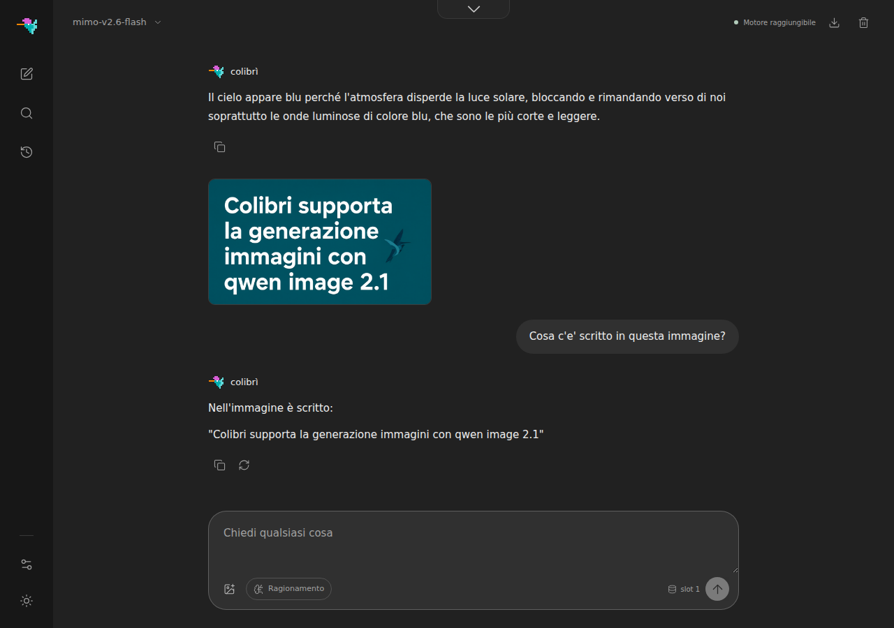
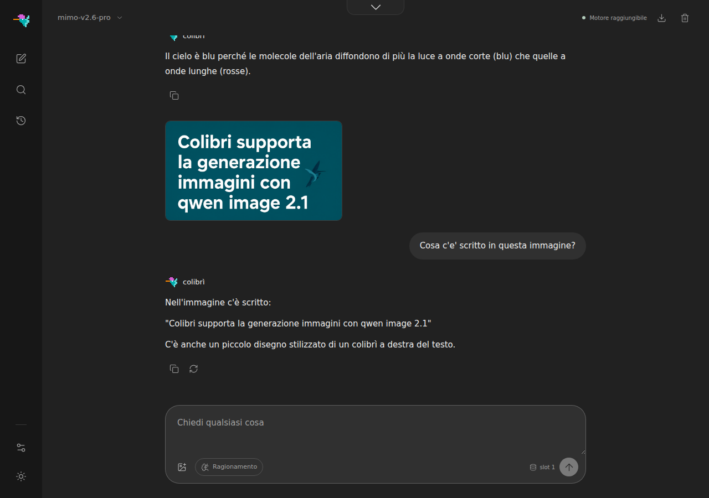

# MiMo-V2.6 (Xiaomi)

Xiaomi's MiMo-V2.6, MIT licensed, in two sizes with one architecture:

| | Flash | Pro |
|---|---|---|
| parameters | 309B, 15B active | 1.02T, 42B active |
| layers | 48: 39 sliding window + 9 full attention | 70: 60 + 10 |
| routed experts | 256, top-8, no shared expert | 384, top-8 |
| on disk | 177.7 GB | 573.5 GB |
| experts per token (cold) | 8 x 47 layers x 12.75 MiB = about 5 GB | about 11 GB |

The checkpoint is read as it is released, **no conversion**:

- **routed experts** are MXFP4 (e2m1 values two per byte, one e8m0 scale per 32
  columns), the same layout colibri already reads for Kimi K3 and DeepSeek V4.1.
  The six tensors of an expert sit back to back in the shard, so an expert is one
  read (`O_DIRECT` by default).
- **dense weights** stay as released: FP8 e4m3 with a scale per 128x128 block for
  qkv and the layer-0 MLP, BF16 for o_proj, router, norms, embeddings and head.
  Re-quantizing the experts to colibri's int4 would cost more bytes (4.5 bits per
  weight against MXFP4's 4.25) and a second rounding.

## Running it

```sh
hf download XiaomiMiMo/MiMo-V2.6-Flash-MOPD --local-dir ~/Models/MiMo-V2.6-Flash
make -C c mimo
coli chat --model ~/Models/MiMo-V2.6-Flash
```

Pro is the same engine and the same commands. Three files of the release are never
loaded (the DFlash drafter, the audio tokenizer and the MTP layer, 9.9 GB together),
so the download can skip them, 563.6 GB instead of 573.5:

```sh
hf download XiaomiMiMo/MiMo-V2.6-Pro-MOPD --local-dir ~/Models/MiMo-V2.6-Pro \
  --exclude "dflash/*" --exclude "audio_tokenizer/*" --exclude "model_mtp.safetensors"
coli chat --model ~/Models/MiMo-V2.6-Pro --ram 54
```

`coli chat`, `coli serve` and `coli web` size the expert cache from the resource plan
when `--cap` is omitted; `--ram N` gives it a budget. The standalone engine takes the
cache (experts per layer) as its first argument, and never goes below one routing
step (8).

```sh
SNAP=~/Models/MiMo-V2.6-Flash SERVE=1 ./c/mimo 64            # the SERVE protocol
./c/mimo ~/Models/MiMo-V2.6-Flash --prompt "Ciao" --ngen 64  # one prompt, by hand
```

## What the engine implements

Each piece mirrors `modeling_mimo_v2.py` from the release:

- **hybrid attention**: `hybrid_layer_pattern` marks each layer sliding window (1) or
  full attention (0). The two kinds have their own KV head counts (8 and 4 on Flash)
  and their own RoPE theta (1e4 and 1e7). A windowed layer keeps a ring of 128
  positions, so on Flash a long context costs the KV of 9 layers.
- **partial RoPE** on the first `int(192 * 0.334) = 64` dims of each q/k head,
  rotate-half style; queries and keys are 192 wide, values 128.
- **value scale**: values are multiplied by `attention_value_scale` (0.707 Flash,
  0.612 Pro) before attention.
- **attention sink** on the windowed layers: one logit per head that joins the
  softmax denominator and nothing else.
- **router**: sigmoid scores; `e_score_correction_bias` chooses the experts but does
  not weigh them; the chosen scores are renormalized.
- **vision**: the MiMo ViT (681M on the release). 2D RoPE, grouped-query attention,
  full attention in 4 of its 28 blocks and a 1D window of 64 tokens in the others,
  alternating row and column order of the 2x2 merge units, a sink on the first key
  of the window blocks, and a LayerNorm + GELU merger. Pictures are preprocessed by
  the gateway exactly as the Qwen2-VL processor does (`tools/qwen38_image.py`).

One storage detail the modeling code does not describe: the fused `qkv_proj` is
**pre-sharded** in `num_key_value_heads` chunks, `[Q_0|K_0|V_0|Q_1|K_1|V_1|...]`, with
the FP8 scale grid tiled per chunk (a Flash full-attention layer has 108 scale rows,
not the 106 a contiguous grid would have). The layout is the one vLLM loads
(`vllm/model_executor/models/mimo_v2.py`); the engine undoes it at load time.

Not implemented yet: the three MTP layers and the separate DFlash drafter (no
speculative decoding), audio and video input.

## Chat template

The gateway renders MiMo's `chat_template.jinja` by hand, byte for byte (held to the
real template by `tests/test_mimo_chat_template.py`): ChatML with no newline after
`<|im_end|>`, every assistant turn carrying its `<think>` block, tools in their own
system turn, calls written inline as
`<tool_call><function=NAME><parameter=KEY>VALUE</parameter></function></tool_call>`,
tool results as a `tool` turn. Through the API, thinking is on unless the request
turns it off (`enable_thinking: false`, or `reasoning_effort: "none"`), as in the
template; with thinking on the cue ends in `<think>`, the token the model writes
first. `coli chat` starts with thinking off, because at about 1 tok/s the template's
default reasoning is minutes of tokens before the answer; `coli chat --think` turns it
on (the web has its own reasoning toggle).

## System One mode and prompt reuse

[System One mode](systemone.md) works on MiMo as on the other engines. `POST /v1/systemone` scores a
closed set of options instead of generating, and `logprobs` on `/v1/chat/completions` and
`/v1/completions` (with `echo`) is served too. What is particular to MiMo is what a
snapshot (`SUBMIT pin=1`) has to hold:

- the **9 full-attention layers** keep their K/V rows by position, and nothing after the
  snapshot writes below it, so they stay in place. The snapshot holds the token ids, and
  the engine checks that the state still holds them before resuming. A prompt that
  diverged in between has rewritten them, and the snapshot is released;
- the **39 sliding-window layers** keep a ring of 128 slots, position p in slot p mod 128,
  with the position each slot holds. The first option overwrites the slots of the
  snapshot's last positions, so the ring is copied into the snapshot and back: about
  50 MB per snapshot on Flash (39 x 128 x 8 heads x (192 + 128) floats), bounded by
  `COLI_PIN_SLOTS` (default 4);
- the position, which is the snapshot's length. Nothing else carries over from one
  token to the next: the sinks are weights and the router has no state.

A prompt with a picture takes no snapshot and resumes from nothing, neither a snapshot
nor the previous turn's state: its ids do not describe the image.

A read-out (`logprobs=k`) resumes only from a snapshot, whose saved logits predict the
first fresh token. With no snapshot it reads every position from 0, the first one
carrying `nan`. It never resumes from the live state of the previous turn, because the
positions before it would have no frame. A chat turn without `logprobs` keeps the
ordinary prefix reuse.

Resuming is exact to the bit, and that needed one change to the forward. The MoE output
of a row used to be summed in the order its experts first appeared **in the prefill
block**, which depends on the other rows of the block. The same position came out with
different low bits in a 64-row block than in a one-row resume, up to 1.2e-4 on the
fixture's logits. Each row's experts are now added in the order its own router chose
them, so a row depends on its own inputs only. A decode step adds in the same order as
before. A prefill now gives the bits that feeding the prompt one token at a time always
gave.

## Correctness

`make -C c mimo-tiny-check` generates a tiny checkpoint (numpy, deterministic) stored
exactly as the release stores its tensors, and compares the engine with tokens from
Xiaomi's own `modeling_mimo_v2.py` (vendor files pinned by SHA-256,
`tools/make_mimo_ref.py`): greedy and teacher-forced, with and without a picture,
every exact configuration of the engine (native dense, an expert cache that evicts
at every layer, prefill in blocks of 1 and 3), and checks that corrupting an expert
scale, the qkv scale grid or the picture changes the answer. It also requires the logits
to be the same **bytes** whatever the prefill blocks and the expert cache, text and
picture: that is what lets a prompt resumed from a prefix or a snapshot equal the same
prompt computed cold.

`make -C c mimo-tiny-serve-check` serves the same fixture and compares against a cold
engine, frame by frame: prefix reuse across turns, System One options that slide the window
past the snapshot, nested snapshots and a sibling question, a snapshot made stale by an
unrelated prompt, prompts with a picture, and `/v1/systemone` and chat logprobs through the
gateway. Every option must process only its own tokens. The gateway's patches
match the official Qwen2-VL processor bit for bit on the fixture's picture.

On the real checkpoint, `tools/mimo_real_check.py` builds Xiaomi's model from the
release's own `modeling_mimo_v2.py` (experts made one at a time as the vendor's
`MiMoV2MLP`, so 48 layers fit in RAM) and compares it with the engine on the same bytes.
Measured on MiMo-V2.6-Flash-MOPD:

| | argmax | max logit difference | max KL |
|---|---|---|---|
| text, 2 layers, 25 positions | 25/25 | 6.3e-7 of the logit range | 1.4e-11 |
| text, 48 layers, 25 positions | 25/25 | 2.5e-6 of the logit range | 1.9e-10 |
| text with a picture, 48 layers, 271 positions | 271/271 | 1.7e-4 of the logit range | 1.0e-6 |

The ViT's 252 output rows for that picture differ from Xiaomi's by at most 3.7e-5
(relative 1.6e-5), and the gateway's patches equal the official processor's exactly.

On MiMo-V2.6-Pro-MOPD, with the same tool and the same 25-token prompt:

| | argmax | max logit difference | max KL |
|---|---|---|---|
| 2 layers | 25/25 | 1.2e-6 of the logit range | 7.3e-11 |
| 8 layers | 25/25 | 1.3e-6 of the logit range | 8.9e-11 |
| 16 layers | 25/25 | 2.2e-6 of the logit range | 3.9e-10 |
| 32 layers | 25/25 | 4.9e-6 of the logit range | 1.5e-10 |

The reference holds the dense weights in f32, which for all 70 layers of Pro is about
80 GiB, so the comparison stops at 32 of the 70 layers, which fit in the 61 GiB of
the test machine.

## Measured

Ryzen 7 PRO 8700GE (8 cores, 16 threads), 64 GB DDR5, NVMe RAID, Linux, with nothing
else running. MiMo-V2.6-Flash, the CLI from a cold expert cache, greedy, a 33-token
chat prompt (thinking off) and 128 generated tokens:

```sh
./mimo /models/mimo-v2.6-flash --cap N --ngen 128 \
  --prompt $'<|im_start|>user\nScrivi un racconto lungo e dettagliato su un colibri che attraversa il Mediterraneo.<|im_end|><|im_start|>assistant\n<think></think>'
```

| experts cached per layer | dense weights | threads | decode | last 64 tokens | resident | expert reads |
|---|---|---|---|---|---|---|
| 32 | as released (exact) | 8 | 2.34 tok/s | 2.33 tok/s | 30.1 GB | 264 GB |
| 32 | as released (exact) | 16 | 2.31 tok/s | 2.30 tok/s | 30.1 GB | 264 GB |
| 64 | as released (exact) | 8 | 2.95 tok/s | 2.94 tok/s | 49.8 GB | 167 GB |
| 64 | as released, `MIMO_IDOT=1` | 8 | 2.95 tok/s | 2.96 tok/s | 49.8 GB | 166 GB |
| 64 | int8 (`MIMO_DENSE_BITS=8`) | 8 | 3.37 tok/s | 3.39 tok/s | 47.5 GB | 166 GB |

- Loading takes about 5 s, and the 33-token prompt from a cold cache 10 to 11 s.
- Expert reads run at 9.8 to 10 GB/s with `O_DIRECT`.
- With 64 experts cached and dense weights as released, the 54 s of a run split into
  expert reads 17 s, expert matmuls 15.5 s, attention with its qkv and output
  projections 18 s, and the rest (dense MLP, router, head) 4 s.
- 16 threads give nothing over the 8 physical cores; the engine picks 8 when
  `OMP_NUM_THREADS` is unset.
- Two runs of the 16-thread configuration agreed within 1%.
- int8 dense weights are not exact: the tokens part from the exact run within the
  first sentence, and the story that follows reads just as well.

Through the gateway: a tool call comes back as `get_weather({"city": "Roma", "days": 3})`
with the integer typed as declared, and asked what is written in a picture made by
colibri's Qwen-Image the model answers with its text, word for word. The same in
`coli web` and `coli chat`:



### Pro

The dense weights stay resident; from the checkpoint headers, what the engine holds:

| | as released (exact) | int8 (`MIMO_DENSE_BITS=8`) | f32 |
|---|---|---|---|
| attention output projection (BF16) | 13.1 GiB | 6.6 GiB | 26.3 GiB |
| attention qkv (FP8) | 11.2 GiB | 10.9 GiB | 43.5 GiB |
| embeddings, head, vision tower, router, layer-0 MLP | 5.8 GiB | 4.2 GiB | 9.8 GiB |
| **total** | **30.2 GiB** | **21.7 GiB** | **79.6 GiB** |

Each cached expert is 18.9 MiB, so one slot per layer over the 69 MoE layers is
1.27 GiB. The KV cache covers only the 10 full-attention layers (the other 60 keep a
ring of 128 positions): 0.78 GiB at an 8k context.

The same machine, prompt and 128 tokens as the Flash table above:

| experts cached per layer | dense weights | decode | last 64 tokens | resident | expert reads |
|---|---|---|---|---|---|
| 12 | as released (exact) | 0.66 tok/s | 0.66 tok/s | 48.0 GB | 1,056 GB |
| 20 | int8 (`MIMO_DENSE_BITS=8`) | 0.79 tok/s | 0.79 tok/s | 50.7 GB | 955 GB |

- Loading takes 16.5 s with the dense weights as released and 39 s in int8 (they are
  quantized at load); the 33-token prompt from a cold cache about 32 s.
- Expert reads run at 10 GB/s, and they are most of the time: with 12 to 20 of 384
  experts cached per layer only 32 to 39% of the routed experts are already resident,
  so a token reads about 6 GB. Attention comes next, because every token reads all
  the dense weights; int8 shortens both, with fewer dense bytes and more RAM left
  for the cache.

Through the gateway (`coli serve --ram 54`, which plans 11 experts per layer), on the
real Pro: thinking off and on, the same tool call with the integer typed as declared,
streaming, and the Qwen-Image picture read back word for word; `coli chat` with the
picture's path at the start of the line, and `coli web` with the upload button:



## On a GPU (Vulkan)

A `make mimo VK=1` build run with `COLI_VULKAN=1` puts the routed experts on the
shared Vulkan expert tier ([vulkan.md](vulkan.md#the-routed-expert-tier-vk_tierc)):
the release's MXFP4 bytes as they sit in RAM, the e8m0 group exponents widened to
the f32 scales the shader reads, SwiGLU on the device. Each MoE step sends the
(row, choice) pairs whose expert is resident to the device as one batch, and the
CPU reads and computes the others meanwhile; an expert the device holds is not read
from disk. Every row then adds its experts in its own routing order, the device's
and the CPU's alike, as the CPU run does. The engine keeps no expert history, so
the tier starts empty and fills as experts pass by: the experts the CPU computed are
offered to it after each step (at most `COLI_VK_TIER_RATE` per token), and once its
budget is full a hotter expert displaces the coldest resident. The router stays on
the CPU, so the experts chosen are the CPU's.

The dense matrices follow the backend's one rule (`COLI_VK_DENSE`): on a discrete
GPU they go to the device; on an integrated GPU or Lavapipe, whose memory is the
CPU's RAM, they stay on the CPU while the tier runs. `COLI_VK_TIER=0` (or
`MIMO_VK_EXPERTS=0`) keeps the experts on the CPU and the dense matrices on the
device, as before the tier.

The device computes with f32 activations, as the CPU does by default: a run with the
tier gives the CPU run's tokens on the tiny fixture in every dense format, text and
picture, and passes Xiaomi's oracle (`tests/vulkan_engines.sh mimo-qwenimage`). Its
logits differ from the CPU's in the last digits, which depend on which experts were
resident: the byte-exact properties above (block invariance, a prompt resumed from a
photo equal to the same prompt computed cold) are the CPU's, and hold with
`COLI_VULKAN` unset, where the engine is the bytes it was before the tier.

## Environment

| Variable | Default | Effect |
|---|---|---|
| `MIMO_DENSE_BITS` | 0 | 0: dense weights as released (FP8, BF16), exact. 8: int8 per row, less RAM, not exact. 32: f32, the oracle's configuration. |
| `MIMO_IDOT` | 0 | 1: int8 activations for the expert matmuls (not exact; no faster in the measurement above). |
| `MIMO_DIRECT` | 1 | 0: buffered expert reads instead of `O_DIRECT`. |
| `MIMO_READ_THREADS` | 8 | Parallel expert reads per layer. |
| `MIMO_CHUNK` | 64 | Prompt tokens per prefill block. |
| `MIMO_CTX` / `CTX` | 8192 | Context the KV cache is sized for (capped by the checkpoint). |
| `MIMO_CAP` | 64 | Expert cache slots per layer when no argument gives one. |
| `MIMO_MAX_IMAGE_TOKENS` | unset | Gateway: ceiling on what one picture costs in prompt tokens. |
| `MIMO_LOGITS` | unset | Oracle: dump every prompt position's logits (f32) to this file. |
| `MIMO_TRACE` | unset | Oracle: dump the residual after every sublayer of the first block. |
| `MIMO_DIRS` | unset | Extra directories holding shards (multi-disk). |
| `COLI_VULKAN` | 0 | 1, in a `make mimo VK=1` build: the routed experts go to the shared Vulkan expert tier, and the dense matrices (qkv, o_proj, the dense MLP, lm_head, and the vision tower's) to the device where `COLI_VK_DENSE` puts them, uploaded at start-up in the form `MIMO_DENSE_BITS` gave them: FP8 with its 128-column block scales and BF16 by default, int8 with 8, f32 with 32. See [On a GPU](#on-a-gpu-vulkan). |
| `MIMO_VK_EXPERTS` | unset | With `COLI_VULKAN=1`: 0 keeps every routed expert on the CPU (no tier); N sizes the expert tier's budget at N experts (`COLI_VK_TIER_GB`, which wins when set). Unset: the tier's own budget. Kept from the engine's own tier before the shared one, which filled up to N and never evicted. |
