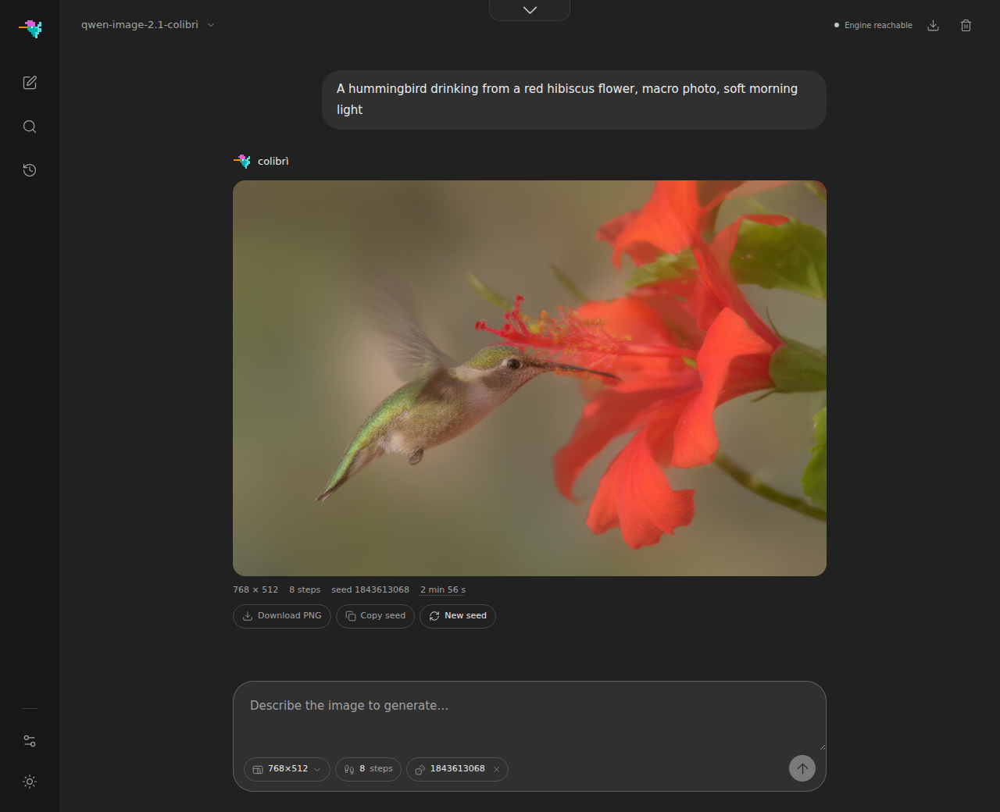
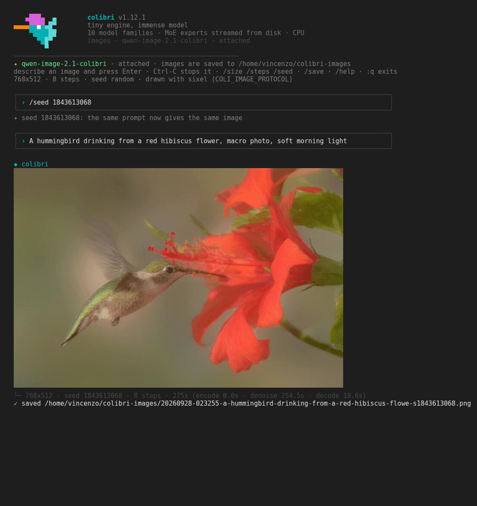
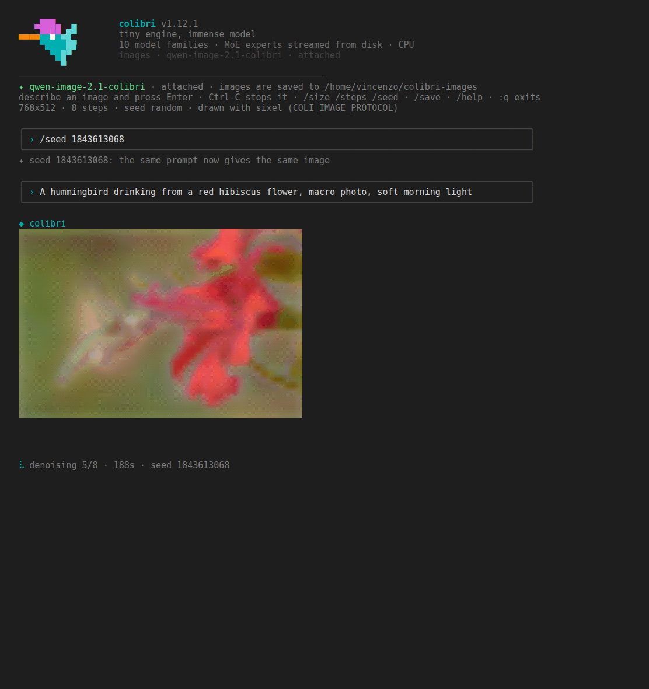

# Qwen-Image-2.1 on colibri

`c/qwenimage` turns a text prompt into a picture with
[`Qwen/Qwen-Image-2.1`](https://huggingface.co/Qwen/Qwen-Image-2.1), read
straight from the official diffusers checkpoint. There is no conversion step:
the engine quantizes the text encoder and the diffusion transformer to int8
while it loads them.

The same front ends as the text models reach it:

- `coli chat` is an image session: type a description, watch the progress,
  and the picture is drawn **inside the terminal**, then saved as a PNG.
- `coli run "prompt"` makes one image and writes it to a file.
- `coli serve` (and `coli web`) expose `POST /v1/images/generations`, the
  OpenAI images API.

<p align="center">
  
</p>
<p align="center">
  
</p>

Both pictures come from the real checkpoint on an 8-core CPU server, same
prompt and seed: the web UI above, `coli chat` attached to the same server
below, as a sixel terminal shows it (the screenshot is xterm.js, the terminal
of VS Code, fed the session's own bytes; Windows Terminal 1.22 and later, foot,
WezTerm and kitty show the same picture). Terminals without graphics get half
blocks, two pixels per character.

## Download

The checkpoint is about 33 GB: a text encoder (Qwen3-VL, 17.5 GB bf16), the
diffusion transformer (14.2 GB bf16), the VAE (1.4 GB f32), the tokenizer and
the scheduler, each in its own folder.

```sh
hf download Qwen/Qwen-Image-2.1 --local-dir ~/Models/Qwen-Image-2.1
make -C c qwenimage
```

Keep the layout as downloaded: coli recognises the model from
`model_index.json` at the root of the folder, and there is no `config.json`
there to add. `coli info --model ~/Models/Qwen-Image-2.1` lists the parts it
found and their size on disk.

## RAM

The text encoder's language model and the transformer are held as int8 with
one scale per row; the text encoder's vision tower and its output head are
never loaded. On the real checkpoint `coli plan` reports (measured from the
safetensors headers):

| part | on disk | in RAM |
|---|---|---|
| text encoder | 17.5 GB bf16 | 7.6 GB int8 |
| diffusion transformer | 14.2 GB bf16 | 7.1 GB int8 |
| VAE | 1.4 GB f32 | 1.4 GB f32 |
| **all resident** | | **16.0 GB** |
| **text encoder on demand** | | **8.5 GB peak** |

With the text encoder on demand it is loaded for each prompt and freed before
denoising starts, so the peak is the larger of the two phases, at the cost of
reading it again for every prompt. Working buffers (the activations, the
VAE's full-resolution feature maps) come on top of both numbers. Measured on
the real checkpoint: `coli run` at 768x512 peaks at **9.0 GB** (the text
encoder is freed before denoising), and a `coli serve` that keeps everything
loaded holds **14.0 GB** once it is ready. The VAE's own working set at
1024x1024 is 1.9 GB on top of its weights.

```sh
coli plan --model ~/Models/Qwen-Image-2.1          # both schedules against your free RAM
coli plan --model ~/Models/Qwen-Image-2.1 --json   # the same as JSON
```

## Chat: images in the terminal

```sh
coli chat --model ~/Models/Qwen-Image-2.1
```

<p align="center">
  
</p>

Every line you type is a prompt. While the engine works, a status line shows
the stage (encoding the prompt, denoising step k of N, decoding) and the
elapsed time; when the engine sends previews, a small version of the picture
is redrawn in place above it. Then the final image is drawn in the terminal
and saved. Ctrl-C stops the current image (the engine finishes the step it is
on and reports it cancelled); a second Ctrl-C leaves.

Commands (TAB completes them, and the sizes after `/size`):

| command | effect |
|---|---|
| `/size WxH` | image size; `/size` alone lists the presets |
| `/steps N` | denoising steps: more is slower and usually cleaner |
| `/seed N` | fixed seed: the same prompt then gives the same image |
| `/seed random` | a new seed for every image (the default) |
| `/render MODE` | how images are drawn: `kitty`, `iterm`, `sixel`, `blocks`, `none` |
| `/save [PATH]` | a copy of the last image where you want it: a folder (the name is kept) or a file name (`.png` is added); never overwrites. Alone, it says where the image already is |
| `/help`, `/quit` | the list, and leave (`:q` works too) |

The first size, steps and seed can also be given as flags:
`coli chat --model ... --size 1024x576 --steps 12 --seed 42`.

If a `coli serve` with this model is already running on `127.0.0.1:8000`,
`coli chat` attaches to it instead of loading a second engine (the model stays
loaded after you quit). `--attach URL` picks another server, `--no-attach`
forces a private engine.

## One image from the command line

```sh
coli run --model ~/Models/Qwen-Image-2.1 --size 1024x576 --seed 42 \
  --out lighthouse.png "a lighthouse on a cliff at dusk, oil painting"
```

Without `--out` the PNG goes to the images folder. When the output is a
terminal the picture is drawn there too; when it is piped, `coli run` prints
only the path on stdout.

## Sizes, steps, seed

- **Size**: both sides a multiple of 32, from 256 to 2048. The engine groups
  image tokens 2x2, which is why 32 and not 16: 16:9 is 1024x576 or 512x288,
  never 768x432. The default is 768x512. The presets, the same ones the web UI
  offers: 512x512, 768x512, 512x768, 1024x576, 576x1024, 1024x1024.
- **Steps**: default 8, from 2 to 200. Eight is a good draft for photographs;
  16 gives visibly better anatomy and colour and is what text inside the
  picture needs to come out legible (compared on the reference pipeline at
  8, 16 and 30 steps; 30 adds little over 16). Time grows with the steps.
- **Seed**: an integer from 0 to 4294967295. When you do not choose one, a
  random seed is drawn and printed with the image, so any picture can be made
  again. Seeds are the engine's own: the same seed does not give the same image
  as the Python diffusers pipeline.

## Where the images go

Every image is saved as a PNG (RGBA) in `~/colibri-images`, named after the
time, the prompt and the seed:

```
~/colibri-images/20260927-153012-a-lighthouse-on-a-cliff-at-dusk-s42.png
```

`COLI_IMAGE_DIR=/some/folder` puts them elsewhere. Nothing is overwritten: a
second image with the same name gets `-2`, `-3`, ... The path is printed under
every image, and `/save PATH` in `coli chat` keeps a copy of the last one where
you choose (a Windows path such as `C:\Users\me\Desktop` works from WSL).

## Terminal support

coli picks the best way to draw that your terminal supports, and falls back to
Unicode half blocks, which work in any terminal with colour.

| terminal | how the image is drawn |
|---|---|
| kitty, Ghostty | kitty graphics protocol (full resolution, transparency) |
| iTerm2, WezTerm | iTerm2 inline images (full resolution) |
| VS Code terminal | iTerm2 inline images when `terminal.integrated.enableImages` is on, half blocks otherwise |
| Windows Terminal 1.22 or newer (also from WSL) | sixel, when the terminal reports it; half blocks otherwise |
| foot, mlterm, xterm with sixel, konsole, mintty | sixel, when the terminal reports it |
| tmux, screen | half blocks (graphics need tmux passthrough) |
| anything else with colour | half blocks, two pixels per character cell, 24-bit colour |

Sixel support is checked by asking the terminal (a device-attributes query
with a timeout of 0.4 s); a terminal that does not answer in time gets half
blocks. Override the choice with `COLI_IMAGE_PROTOCOL`:

```sh
COLI_IMAGE_PROTOCOL=sixel coli chat --model ...    # kitty | iterm | sixel | blocks | none
```

`/render` switches it inside a session. Other knobs: `COLI_IMAGE_PREVIEW=0`
turns the live preview off, and `COLI_IMAGE_MAX_PX` caps the width of a sixel
image in pixels (default 1024).

## HTTP API

`coli serve --model ~/Models/Qwen-Image-2.1` starts the gateway on
`127.0.0.1:8000`, with the same API key, CORS and Host rules as for text
models (`--api-key` or `COLI_API_KEY`).

```sh
curl -s http://127.0.0.1:8000/v1/images/generations \
  -H 'Content-Type: application/json' \
  -d '{"model": "qwen-image-2.1-colibri", "prompt": "a red fox in the snow",
       "size": "1024x576", "steps": 8, "seed": 42}' \
  | python3 -c 'import sys, json, base64; d = json.load(sys.stdin);
open("fox.png", "wb").write(base64.b64decode(d["data"][0]["b64_json"])); print(d["colibri"])'
```

Request fields: `model`, `prompt`, `size` (`"WxH"`, or `width` and
`height`), `steps`, `seed`, `n` (must be 1), `response_format` (only
`b64_json`), `stream`. The answer:

```
{"created": <unix time>,
 "data": [{"b64_json": "<PNG, base64>", "revised_prompt": null}],
 "colibri": {"width": 1024, "height": 576, "seed": 42, "steps": 8,
             "timings": {"encode": <s>, "denoise": <s>, "decode": <s>}}}
```

`colibri.seed` is the seed actually used, drawn by the server when the request
did not give one.

With `"stream": true` the answer is Server-Sent Events:

```
event: image_generation.progress
data: {"stage": "denoise", "step": 3, "steps": 8, "elapsed": <seconds so far>}

event: image_generation.partial_image
data: {"b64_json": "<small PNG>", "partial_image_index": 0}

event: image_generation.completed
data: {"created": ..., "data": [...], "colibri": {...}}

data: [DONE]
```

`step` counts the denoising steps already completed (0 as the first one
starts). Partial images are small previews and arrive only when the engine
sends them; `"partial_images": 0` turns them off and `"partial_images": k`
spreads at most k of them over the run. If the generation fails after the
stream has started, the stream ends with `event: error` carrying
`{"error": {"message": ..., "type": ...}}` and then `data: [DONE]`.
Closing the connection cancels the generation.

Errors are OpenAI-shaped: HTTP 400 for a bad size, an empty prompt or
`n` other than 1 (the message names the rule); 503 when the queue is full,
since the engine draws one image at a time. `GET /v1/models` marks the model
with `"capabilities": ["image_generation"]` and its size rules;
`/v1/chat/completions` answers 400 and points to the images endpoint.

## Timings

Measured on a server with 8 Zen 4 cores (AVX-512, 8 OpenMP threads), 768x512,
8 steps, int8 weights:

| | per denoising step | one image |
|---|---|---|
| int8 activations in the DiT (default where VNNI exists) | 18.3 to 19.6 s | 3.4 min with `coli run` (load included), 2 min 40 s through a loaded `coli serve` |
| f32 activations (`COLI_IMG_ACT8=0`) | 34.3 s | 5.5 min with `coli run` |

- The text encoder and the prompt's side of the transformer take about 3.5 s
  on a loaded server, and nothing at all when the same prompt comes back with
  a new seed: they are computed once per prompt and kept.
- The VAE decodes 512x512 in 7 s, 768x512 in 10 to 12 s, 1024x1024 in 29 s.
- For reference, the diffusers pipeline in PyTorch runs the same step in
  17.2 s in bf16 on the same machine, and its f32 run peaked at 31.8 GB of
  RAM; colibri stays within 9 GB and needs neither Python nor torch to
  generate.
- The int8 activations are what VNNI makes fast (four multiply-adds per lane
  instead of one). They are kept out of the text encoder, whose hidden states
  carry a few very large channels that one scale per token cannot hold, and
  used only in the transformer's blocks: against the f32 reference the image
  scores 30.1 dB with them and 35.6 dB without, and by eye the two cannot be
  told apart.

On a GPU, a `make qwenimage VK=1` build with `COLI_VULKAN=1` runs the
transformer there. With the device chain (`qwenimage_chain.h`, on by default on a
discrete GPU and on a Radeon 780M, `COLI_VK_CHAIN=0` to keep it off) every block of
a step runs on the device with the image tokens resident from the input layer to
the output layer: the modulated norms, q/k/v, the per-head norms and RoPE, the
attention of the image tokens over the prompt's tokens and their own, the gated
residuals and the MLP. The prompt's keys and values go up once per prompt, the
timestep's modulation once per step, the latents up and the prediction down once
per step. Without the chain (`COLI_VK_CHAIN=0`, or a device that refuses the
chain's buffers) the matrices run there one by one and the attention on the CPU,
as before. The weights keep the storage `COLI_IMG_BITS` gave them (int8 by default,
bf16 or f32) and the activations stay f32, so `COLI_IMG_ACT8` does not apply on the
device and the result is the CPU's `COLI_IMG_ACT8=0` run up to summation order. When
the chain runs, the VAE decodes on the device too (`qwenimage_vae_vk.h`: its 3x3
convolutions as a band's taps and one GEMM, the norms, the shortcuts; the mid block's
attention over every pixel on the CPU), with the CPU's decode as the fallback. The
text encoder runs on the CPU.

A card whose free memory does not hold the transformer (it is 7.1 GB in int8: a 6 or
8 GB card) keeps the blocks that fit and uploads the others at every step, two at a
time, each going up while the block before it runs; their matrices never go through
the one-by-one path, so the device is not asked for more memory than it has. The
start says how many blocks stay (`[VK] qwenimage: 9 of 32 blocks stay on the
device`), and `COLI_VK_QI_RESIDENT=n` forces the number. On the 780M, streaming
every block costs 0.3 s on a 512x512 step (5.64 s against 5.35); a discrete card
moves them over PCIe, about 6.5 GB a step. With blocks streamed, the VAE decodes on
the CPU.

`COLI_VK_QI_ATTN=coop` runs the attention on the device's matrix units (tensor
cores, WMMA, XMX; cooperative matrices at subgroups of 32 or 64) with int8 weights:
f16 operands, the result the f32 attention's to about one part in a thousand. It is
off by default because on the 780M it is slower (a 1024x1024 step's attention 32.5 s
against 17.9): RDNA3's matrix units are only twice its f32 rate. A card whose matrix
units outrun its f32 by more may gain; that has not been measured.

Measured on a Radeon 780M (an integrated GPU sharing the RAM of the 8-core Zen 4
above), 8 steps:

| | 512x512, a step | 1024x1024, a step | 512x512, one image |
|---|---|---|---|
| CPU | 11.6 s | 67 s | 1 min 52 s |
| GPU, the matrices one by one | 11.8 s | 63 s | |
| GPU, the chain | 5.4 s | 38 s | 61 s |

The image's time with the chain: 11 s to load and encode the prompt, 42 s of
denoising, 7.5 s of VAE (6.1 s of it on the device; 8.0 s on the CPU). At 1024x1024
the VAE takes 24 s on the 780M against the CPU's 28 to 30: an integrated GPU's f32
products gain little there, a discrete card's more. Loading went from 34 s to 7.5 s in this release: four
layers at once, each matrix quantized straight from its bf16 rows
(`COLI_IMG_LOAD_THREADS` sets how many; each holds one matrix's bf16 bytes, up to
about 140 MB, while it quantizes). On a 1024x1024 step the 780M spends half the
time in the attention (the image tokens over each other, 4096 of them), the other
half in the matrices. A discrete card has not been measured on this path yet; the
matrices-one-by-one path took a 512x512 step in 4.5 s on an RTX 5060 Ti 16 GB
(#1910), the attention still on the CPU.

Every stage of the engine is checked against the diffusers pipeline: on the
real checkpoint in f32 the text encoder, all eight denoising steps and the VAE
agree to about one part in a million, and of the million bytes of the final
image 13 differ, each by one. A tiny random pipeline in the same layout runs the
same comparison in CI.

## License

Qwen-Image-2.1 is released under the **Qwen Research License**: research and
other non-commercial use only. Read `LICENSE` in the checkpoint folder before
using the images or the model for anything else, and never redistribute the
weights. colibri's code is under its own license; the weights are not.
