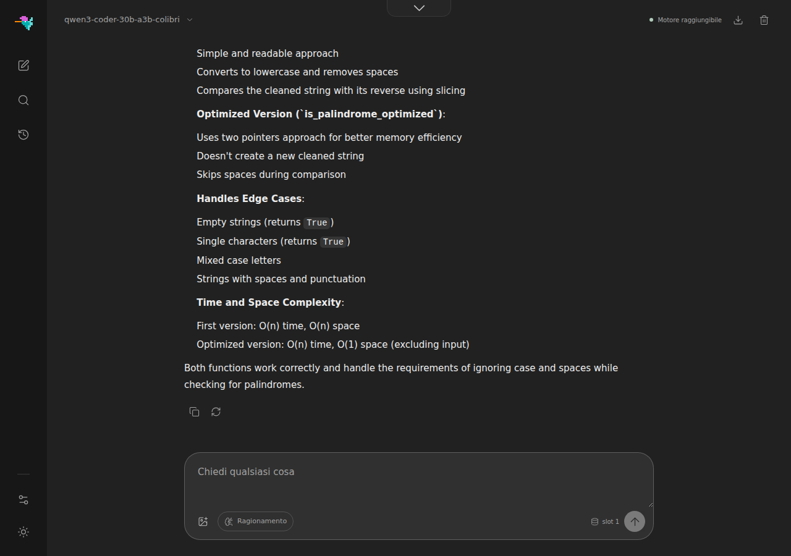

# Qwen3.6-35B-A3B on colibri

`c/qwen36.c` runs [Qwen/Qwen3.6-35B-A3B](https://huggingface.co/Qwen/Qwen3.6-35B-A3B)
(35B total / ~3B active, Apache 2.0) — a hybrid architecture: 25% Gated
Attention layers, 75% Gated DeltaNet (linear attention) layers, each followed
by a streamed MoE block (256 experts, top-8 + 1 shared). Dense weights stay
resident; routed experts stream from the container through an LRU + pinned
cache. Development notes live in `docs/qwen36-phase01.md` /
`qwen36-phase02.md`.

Architecture-identical checkpoints (same config geometry, e.g.
KAT-Coder-V2.5-Dev) run on this engine unchanged.

## Quickstart

Pre-converted containers (int4 experts, self-contained, ~23 GB):

```sh
# group-scaled int4 (gs64) — recommended, see "Which container" below
hf download Kreuzzelg/qwen36-35b-a3b-colibri-i4-gs64 --local-dir ~/Models/qwen36_i4_gs64

# per-row int4
hf download Kreuzzelg/qwen36-35b-a3b-colibri-i4 --local-dir ~/Models/qwen36_i4
```

or convert the original bf16 checkpoint yourself (~70 GB download):

```sh
python3 c/tools/convert_qwen36.py --repo Qwen/Qwen3.6-35B-A3B --out ~/Models/qwen36_i4_gs64 --gs 64
```

Build and chat:

```sh
make -C c qwen36
COLI_MODEL=~/Models/qwen36_i4_gs64 ./c/coli chat
```

`coli` reads the model's `config.json` and matches its `model_type` against the
family registry (`qwen3_5_moe` / `qwen3_5_moe_text` — an exact match, so other
Qwen architectures are not claimed by this engine), picks it, and drives it over the serve protocol — `coli web` and
`coli serve` (OpenAI-compatible API) work the same way.

Tool calling is supported through the HTTP gateway using Qwen3.6's native
`<tool_call>` / `<tool_response>` protocol. The gateway translates between
the native format and the supported API tool representations; see the
[per-engine API matrix](api.md#tool-calling-support).

Direct invocation without the gateway:

```sh
SNAP=~/Models/qwen36_i4_gs64 TOK=~/Models/qwen36_i4_gs64/tokenizer.json \
N_NEW=200 ./c/qwen36 256 4 prompt.txt
```

## CPU prefill batching

On AVX2/FMA CPUs, dense int8 projections process two prompt rows per weight
decode.  The same kernel is used by attention, the router, DeltaNet projections,
and the CPU shared expert.  `S=1` decode keeps the original four-register GEMV,
and non-AVX2 builds retain the established per-row implementation.  The shared
expert additionally batches gate/up/down calls across prompt rows with at most
32 MiB of temporary activations; the CUDA expert tier keeps its per-token shared
work so it can continue to overlap the in-flight GPU groups.

Both optimizations are bit-exact and on by default.  For controlled A/Bs,
`QWEN_DENSE_BATCH=0` restores per-row dense-int8 GEMVs and
`QWEN_SHARED_BATCH=0` restores per-row shared-expert calls.  A positive
`QWEN_SHARED_BATCH=N` limits each shared chunk to `N` rows.

Requirements: ~30 GB RAM for comfortable expert caching and NVMe storage for
the container. The default build is CPU-only; `make -C c qwen36 CUDA=1` adds
the optional CUDA VRAM expert tier documented in
[`qwen36-cuda-tier.md`](qwen36-cuda-tier.md). The same tier builds for AMD
through ROCm with `make -C c qwen36 HIP=1 HIP_ARCH=<gfx>` (for example
`HIP_ARCH=gfx1151`, with `ROCM_HOME` and `HIPCC` pointing at the toolchain):
measured on a Ryzen AI MAX+ 395, output bit-identical to the CPU path and 2.4x
faster than CPU-only (#1502).

## Vulkan

In a `VK=1` build (`make -C c qwen36 VK=1`), `COLI_VULKAN=1` puts the dense trunk on
the Vulkan device and the routed experts on the shared Vulkan expert tier
(`c/vk_tier.c`, [vulkan.md](vulkan.md#the-routed-expert-tier-vk_tierc)): a cache of
experts in device memory, filled at startup from the expert history and adapted
while you chat, computed by the device while the CPU computes the rest of the
layer step, every expert's output joining its row in rank order. It takes every
container this engine reads: the shared kernel's planar int4-g64 slots, the int8
copy of an int4 container (packed back to int4 on the device), int8 per row or gs64,
and the mixed int4 gate/up + int8 down layout. On an integrated GPU (or Lavapipe) the
trunk stays on the CPU by default while the tier is on, where it costs more on the
device than the tier gains; a discrete GPU takes both. `COLI_VK_DENSE=0` keeps the
trunk on the CPU anywhere and `COLI_VK_DENSE=1` puts it on the device anywhere;
`COLI_VK_TIER=0` turns the tier off (the trunk then goes to the device).

This engine kept no expert history before; with the tier on it keeps route_trace.h's
`.coli_usage` beside the container (`COLI_USAGE` moves it), saved at the end of
every run and serve turn, and fills the tier from it at the next start. `coli
setup` gives Qwen3.6-35B-A3B a starting one ([vulkan.md](vulkan.md#the-routed-expert-tier-vk_tierc)). With
`COLI_CUDA=1` as well, the CUDA tier wins.

On an integrated Radeon 780M, with the int4 gs64 container at cap 64 and the trunk
on the CPU, the tier decoded at 8.03 tok/s against the CPU's 6.02 and reached the
first token of a 512-token prompt in 12.3 s against 35.7 s, the same text; the
measurements and what they leave out are in
[vulkan.md](vulkan.md#measured-on-a-radeon-780m). With the dense chain on as well
(the default for this engine on an integrated GPU with the tier), decode reached
9.94 tok/s against the CPU's 6.01 and the 512-token prompt 9.5 s
([vulkan.md](vulkan.md#the-chain-on-a-radeon-780m)).

## Prompt-lookup drafts (on by default, `COLI_LOOKUP=0` turns them off)

When the recent tokens repeat an n-gram of the prompt or the output (a code edit, a
quote, repeated structure), the engine drafts the up to 5 tokens that followed it
and checks them in one verify forward. The DeltaNet state is copied after each verify
row, so a rejected draft rolls back by swapping a copy in. A gate drafts only where the
measured acceptance and verify cost say it pays. The output is that of plain decoding,
greedy or sampled, on the CPU and in the Vulkan dense chain. Lookup stays off under the
CUDA tier, `CACHE_ROUTE` and a qpack container, whose results depend on what is
resident. On a code edit, Qwen3.6-35B-A3B decoded 7.90 tok/s with lookup against 7.42 without (1.56 tokens per forward); on a chat prompt the gate declined every proposal and the speed was unchanged. How it works, the gate, the settings and the tests:
[speculative.md](speculative.md).

## The expert kernel

Routed experts run through `c/expert_ffn.h`, a header shared with the other
MoE engines rather than a set of GEMVs of this engine's own. Three things
changed with it, measured on the real gs64 container at full residency on an
8-core AVX-512 box (61 GB, DDR5-5600, 58 GB/s DRAM read):

- **The int4 stays int4.** The engine used to unpack every expert to int8 at
  load; the kernel keeps the container's nibbles, repacked once into a planar
  layout where `and 0x0F` yields 32 elements in order and `srli 4` the other
  32, so a block costs no unpack instruction. Half the bytes per token and half
  the expert-cache RSS: peak RSS at cap 256 went from 25 GB to 15 GB.
- **A layer is a unit of work.** gate+up share one pass over the activation,
  and threads split (expert, row-chunk) items: two OpenMP regions per layer
  instead of 3 x top-k. A prompt row routed to an expert another row already
  used reads that expert from cache, not DRAM.
- **Same tokens.** Activations stay f32 (the kernel also has an int8
  activation mode, `mode 1`, not wired in here: same policy as `IDOT`). The
  only difference from the old path is the accumulation order inside a dot;
  a 1024-token greedy decode on the real container is byte-identical, and CI
  pins old vs new on a tiny int4 fixture at caps 1, 2, 8 and 16.

Over a 1024-token greedy decode at cap 256 (same prompt, byte-identical
text): 12.8 -> 15.7 tok/s, MoE per token 34 -> 20 ms on average and 30 -> 17
ms in the last windows, peak RSS 29 -> 17 GB. Of the 20 ms, 11 are the kernel
(the DRAM floor for the int4 bytes is 9) and 6 are the residual misses of a
97.6% hit rate, fetched one at a time; that fetch is the next thing to
overlap, not this kernel. `tests/test_expert_ffn` holds the numerics.
`QWEN_EXPERT_KERNEL=0` restores the int8 path for A/Bs. The CUDA expert tier
keeps its own path: it uploads the pair-layout int4 and computes misses from
the int8 copy.

## The dense trunk: integer dot products

Every dense GEMV of a token, the DeltaNet in and out projections, the
attention q/k/v/o, the shared expert and lm_head, used to multiply int8
weights by f32 activations: each weight byte converted to f32 and fed to an
FMA, eight weights per instruction. On a 16-core AVX-512 host lm_head
(248320 x 2048 int8, 508 MB) ran at 29 GB/s on a memory bus that does 80:
the kernel was the limit, and the dense part of the token is 1.9 GB of int8
on the 35B, three times what the routed experts read.

Since 1.12.1 the activation is quantized to int8 once per call (one scale,
amax/127, the same contract the expert integer kernels use) and the products
are integer: 32 weights per instruction on AVX2, 64 on AVX-512 VNNI, exact
int32 sums scaled once per output. The routed experts take the same path for
their activations. Measured on Qwen3.6-35B-A3B, 8 threads, 300 decoded
tokens, every expert resident, perplexity on 4 x 512 tokens of English text:

| | tok/s | ms/token: DeltaNet proj / out, attention, lm_head, expert compute | perplexity |
|---|---|---|---|
| f32 activations (1.12.0) | 6.71 | 21.9 / 8.6, 9.5, 12.6, 22.7 | 13.79 |
| int8 activations, dense trunk (`COLI_DENSE_IDOT=1`) | 7.35 | 17.4 / 6.3, 7.7, 10.2, 22.7 | 13.92 (+1.0%) |
| int8 activations, routed experts (`QWEN_EXPERT_ACT=i8`) | 7.20 | 21.9 / 8.6, 9.5, 12.6, 15.9 | 13.80 (+0.1%) |
| both (the 1.12.1 default) | **8.23** (+22.6%) | 17.2 / 6.3, 7.5, 10.1, 15.6 | 13.97 (+1.3%) |

Both are the default; `COLI_DENSE_IDOT=0` and `QWEN_EXPERT_ACT=f32`
restore the f32 kernels, which stay bit-identical to their references.

**int4 for the trunk is opt-in, per component.** `COLI_DENSE_BITS=4` stores
the dense matrices as int4 in blocks of 64 with one scale per block (the
planar layout of the grouped expert kernel) and halves the bytes the token
reads, but the parts of the trunk pay 4 bits very differently, so
`COLI_DENSE_INT4` picks which ones take it:

| int4 on | tok/s | perplexity |
|---|---|---|
| nothing (int8) | 7.35 | 13.92 |
| `lmhead` | 8.15 (lm_head 10.1 to 8.4 ms; the total is within noise of the cache warming) | 14.13 (+2.4% vs f32) |
| `lmhead,dnproj,dnout` | | 14.56 (+5.6%) |
| `lmhead,dnproj,dnout,shexp` | | 14.94 (+8.3%) |
| everything (`attn` included) | 8.09 | 15.17 (+10%) |

A least-squares refinement of the block scale was tried and changes nothing
(15.16 against 15.17): the loss is the matrices' sensitivity, not the
quantizer. If you take one, take `lmhead`: 254 MB less per token for the
smallest cost.

## Cache-aware routing (`CACHE_ROUTE`, off by default)

The residual misses above are the lever's target. `CACHE_ROUTE=1` ports the
GLM engine's max-rank re-routing ([CACHE_ROUTE.md](CACHE_ROUTE.md),
arXiv:2412.00099) to this engine with two residency levels: inside the top-`M`
window, a slot past the sacred top-`J` prefers an expert already in the VRAM
tier, then one in the RAM cache, then the plain ranking. It is **lossy**: it
changes which experts run, so the semantic contract is off while it is set and
the footer prints what it cost, `route_agree` (overlap with the true top-K)
and `route_kl` (mass KL), next to the swap and hit rates. Unset, the router
is the original loop and the token ids are byte-identical; `ROUTE_AGREE=1`
alone prints the meters at 100 % / 0 without touching routing.

Qwen3.6 routes top-8 (plus the shared expert), so the default `ROUTE_J=2`
leaves six substitutable slots per token; the tiny fixture routes top-2 and
needs `ROUTE_J<2` to show any swap at all. A/B it the way the GLM doc does:
same prompt and seed, tok/s and hit rate against agreement and KL, and treat
`PPL=1` on a teacher-forced reference as the quality bar.

## Which container?

The gs64 container carries one scale per 64-weight group instead of one per
row. Against the per-row container it measured a cosine to the int8 anchor of
0.99313 instead of 0.98777 and a KL of 0.080 instead of 0.109, about 44% less
quantization error. On GLM, per-row int4 was the root cause of think-mode loops and
never-terminating generations (#455), and group scales fixed them in
controlled A/Bs — with `moe_intermediate_size=512`, Qwen's rows are short, so
per-row quantization error concentrates the same way. The gs64 container costs
~1.7 GB more on disk and a few percent on cold-start; warm decode speed is the
same or slightly better.

**Mixed: int8 `down`, int4 gate/up.** `convert_qwen36.py --ebits 4 --gs 64
--down-bits 8` (`--down-gs` for grouped down scales, 0 = per row) writes one
slab per expert with `down_proj` in int8 and gate/up as above -- 5.7 bits per
weight against gs64's 4.5. It is the knob that produced the #1370 numbers on
wikitext-2 (16 x 512 tokens): gs64 7.325, mixed 7.281, all experts int8 7.153,
Ollama's Q4_K_M 7.147 -- `down` alone recovers a quarter of the gap to int8,
the rest sits in gate/up, and at equal bits Q4_K_M's asymmetric quantizer is
ahead. Keep it as a measurement tool and a middle step for boxes with RAM to
spare; it is not the answer to the gap. The engine tells the layout apart by
size and reads each matrix in its own format on the CPU path; the CUDA VRAM
tier takes one format per expert and refuses a mixed container with a line
(`COLI_CUDA=1 ignored`), so such a container runs CPU-only for now.

## Which checkpoints, and what the banner calls them

These Qwen checkpoints resolve to this engine: two hybrid MoE ones that declare
`model_type: qwen3_5_moe_text`, a dense one that declares `qwen3_5`, and the
all-attention Qwen3 MoE (`qwen3_moe`) of Qwen3-Coder:

| checkpoint | layers | experts | hidden | banner |
|---|---|---|---|---|
| Qwen/Qwen3.6-35B-A3B | 40 (10 attention) | 256, top-8 | 2048 | `Qwen3.6-35B-A3B · 35B MoE` |
| Qwen/Qwen3.8-2.4T-A95B | 92 (23 attention) | 512, top-10 | 8192 | `Qwen3.8-2.4T-A95B · 2.4T MoE` |
| Qwen/Qwen3.8-27B | 64 (16 attention) | none: one MLP of 17408 per layer | 5120 | `Qwen3.8-27B · 27B` |
| Qwen/Qwen3-Coder-30B-A3B-Instruct | 48 (all attention) | 128, top-8 | 2048 | `Qwen3-Coder-30B-A3B · 30B MoE` |
| cerebras/Qwen3-Coder-REAP-25B-A3B | 48 (all attention) | 103, top-8 | 2048 | `Qwen3-Coder-REAP-25B-A3B · 25B MoE` (named, not run here) |

The registry names a checkpoint by its geometry (`display_variants` on the
`qwen36` descriptor), so the banner says what is on disk. A config that
matches neither, a tiny fixture for instance, is named by its own
`model_type` and measured geometry rather than by a sibling's parameter
count (#1045).

The 2.4T checkpoint is **architecture-identical** to the 35B: same layer
pattern, every engine guard holds, and the registry's planner puts its KV
cache at 1.44 GiB for 8k context and 46 GiB at the 256k maximum, with a
context-free DeltaNet state of 0.55 GiB. What this engine cannot do for it
is hold the experts: the warmstart keeps every expert in RAM by design (see
`--ram` below), which is ~1.4 TB of int4 for 2.4T. Serving it needs the
disk-streaming design, not this one. The conversion and the geometry checks
are in place so that work starts from a verified shape, not from a guess.

### The dense 27B

Qwen3.8-27B (#1757) is `Qwen3_5ForConditionalGeneration`: the same Gated
DeltaNet + gated attention layers, with one SwiGLU MLP per layer and no
router. The engine loads that MLP as the shared expert, ungated, and routes
nothing; the converter writes `num_experts: 0` and the MLP width into
`qwen36_meta.json`. It ships Qwen3.8's `chat_template.jinja`, not Qwen3.6's
(the same file the qwen38 renderer is pinned to): the converter copies it
into the container, and the gateway recognises it and renders with the
Qwen3.8 rules (reasoning on by default at `xhigh`, the XML tool-call form,
history that keeps its thinking) while the engine stays qwen36. The API model
id is `qwen3.8-27b-colibri`.

```bash
python3 tools/convert_qwen36.py --model <Qwen3.8-27B download> --out q27_c
./coli chat --model q27_c --gpu none
```

The container keeps the weights in f16 (51 GB) and the engine quantizes
them while loading. Every weight is read for every token, so speed is set by
memory bandwidth, not by the disk. Measured on a 16-thread CPU server
(8 OpenMP threads), perplexity over 1000 tokens of human-written text:

| dense weights | RSS | scoring | perplexity, English | perplexity, Italian |
|---|---|---|---|---|
| int8 (default) | 29.1 GB | 2.25 tok/s | 4.85 | 11.19 |
| `COLI_DENSE_BITS=4 COLI_DENSE_INT4=shexp,lmhead` | 21.6 GB | 3.15 tok/s | 4.94 (+1.8%) | 11.69 (+4.5%) |
| `COLI_DENSE_BITS=4` (everything) | 18.8 GB | 3.72 tok/s | 5.02 (+3.5%) | 12.15 (+8.6%) |

Through the gateway (`coli serve`), greedy decode ran at 2.1 tok/s in int8 and
3.45 tok/s with everything in int4, after a load of 73 and 114 s; the answers
to the same English, Italian and Turkish questions were the same but for a word.

The MLP is 17 of the 27 billion parameters, so int4 on the MLP and the LM head
keeps most of the saving at half the loss. With a matrix in int4 the engine
no longer keeps its int8 copy (`COLI_DENSE_KEEP_I8=1` does); that is what
brings the full int4 run from 42.4 to 18.8 GB.

#### Images

Qwen3.8-27B reads images. Its vision tower is the ViT of the whole family
(27 blocks, hidden 1152, patch 16, 2x2 merge; only the output width follows
the text model), so the engine runs it through the same `qwen38_vision.h`
the qwen38 engine uses, now split across OpenMP threads. The converter copies
it into `model-vision.safetensors` and writes its shape into
`qwen36_meta.json`, together with `preprocessor_config.json`.

What is specific to this family is where the image sits in the rope. The
attention layers use interleaved M-RoPE (`mrope_section` [11, 11, 10]): an
image token at merged (row, col) is rotated by (start, start + row,
start + col), the text after the image resumes at start + max(rows, cols),
and every later position carries that offset (HF's `rope_deltas`). The
engine follows `Qwen3_5Model.get_rope_index` exactly; with plain 1D
positions the tiny oracle below loses 10 of 16 tokens.

An image reaches it the way it reaches the other vision engines: a path in
a `coli chat` message, an attachment in `coli web`, or an `image_url` part
on `/v1/chat/completions`. One image per request. `Q36_MAX_IMAGE_TOKENS`
caps the tokens an image costs (the preprocessor's own ceiling is far above
what a CPU prefill wants); the image is shrunk, not cropped.

`tools/make_qwen36_vl_tiny.py` builds a toy `Qwen3_5ForConditionalGeneration`
and a reference from transformers with one 4 x 8-patch image; the engine
matches it token for token, and `tests/test_qwen36_vision_serve.py` holds the
IMAGE frame path to the same tokens. Qwen3.6-35B carries the same tower, so a
35B container converted with this converter gets images too; only the 27B has
been run with real pictures.

Not yet: the CUDA tier (a dense checkpoint runs on the CPU), the MTP head
(skipped by the converter), video, and an int4 container on disk.

### Qwen3-Coder-30B-A3B

Qwen/Qwen3-Coder-30B-A3B-Instruct (Apache-2.0) is `Qwen3MoeForCausalLM`: 48
attention layers and no DeltaNet, no attention output gate, no shared expert,
rotary over the whole head (`rope_theta` 1e7), plain RMSNorm weights, and 128
experts top-8 renormalized (`norm_topk_prob`). The converter recognises
`model_type: qwen3_moe` and writes exactly that into `qwen36_meta.json`
(all-attention `layer_types`, `shared_inter: 0`, `partial_rotary_factor: 1.0`,
`zero_centered_norms: false`); the engine then skips the shared expert and
passes the attention output ungated. The REAP prunes are the same
architecture with fewer experts and resolve to the same family under their
own name. The chat template is its own: tools as XML, calls as
`<tool_call><function=...><parameter=...>`, and no thinking at all. The gateway
recognises it from the template, renders it byte for byte
(`tests/test_qwen3_coder_chat_template.py` holds it to the release's
`chat_template.jinja`), and keeps `enable_thinking` off. The API model id is
`qwen3-coder-30b-a3b-colibri`.

```bash
hf download Qwen/Qwen3-Coder-30B-A3B-Instruct --local-dir qwen3-coder     # 61.1 GB, bf16
python3 tools/convert_qwen36.py --model qwen3-coder --out qwen3-coder-i4 --ebits 4 --gs 64
coli serve --model qwen3-coder-i4 --cap 128     # every expert in RAM
coli serve --model qwen3-coder-i4 --cap 32      # 6.5 GB resident
```

The int4 gs64 container is 19 GB and converts in under a minute; `--ebits 8`
gives a 30 GB int8 one. As everywhere on this engine, `--cap` sizes the
expert cache and `--ram` does not (see below).

Against the bf16 release, on a 325-token code question and answer, teacher
forced (every position's logits; the reference reads the release one layer at
a time in f32):

| experts | dense trunk | top-1 = bf16 | top-5 overlap | mean \|Δ log p\| | max \|Δ log p\| |
|---|---|---|---|---|---|
| int4 gs64 | int8 (the default) | 96.9% | 91.1% | 0.176 | 3.74 |
| int4 gs64 | f32 (`COLI_DENSE_I8=0`) | 96.0% | 91.7% | 0.134 | 2.59 |
| int8 | int8 | 95.1% | 95.2% | 0.098 | 2.13 |
| int8 | f32 | 98.1% | 97.8% | 0.022 | 0.60 |

Decode on a Ryzen 7 PRO 8700GE (8 cores, 64 GB, NVMe RAID), the CLI from a cold
cache, 128 tokens, dense trunk int8:

| container | experts cached per layer | decode | resident |
|---|---|---|---|
| int4 gs64 | 128 (all) | 8.5 and 9.6 tok/s (two runs) | 15.2 GB |
| int8 | 128 (all) | 6.4 tok/s | 25.1 GB |
| int4 gs64 | 32 | 5.1 tok/s | 6.5 GB |
| int8 | 32 | 3.8 tok/s | 9.6 GB |

Through `coli chat` with `--cap 128` and the cache warm, a 577-token answer
streams at 13 tok/s. Prefill is the slow part on the CPU: a request whose tool
block makes the prompt about 500 tokens takes around two minutes from a cold
cache.



### The converter's tensor contract

Both checkpoints ship experts **fused** per layer (`mlp.experts.gate_up_proj`,
`mlp.experts.down_proj`), a one-layer multi-token-prediction head (`mtp.*`,
`mtp_num_hidden_layers: 1`), and the 35B additionally a vision tower
(`visual.*`). `tools/qwen36_tensor_kinds.py` classifies every tensor name
before the first shard is read: layer tensors are converted, `mtp.*` and
`visual.*` are skipped **on purpose** and reported with a count, and a name
the contract does not know stops the conversion. A converter that silently
drops what it does not recognise produces a container that loads and is
quietly missing a tensor; this one refuses instead (the GLM-5.3 precedent).
`tests/test_qwen36_tensor_kinds.py` pins the contract to both real indexes.

### Validating the 2.4T shape without a single weight

`tools/make_qwen36_tiny.py --geometry qwen38-2p4t` builds a fixture with the
2.4T's structural numbers at toy widths -- 92 layers, interval 4, 512 experts
top-10, 16:1 attention heads, 8:1 DeltaNet heads -- and rewrites the shard
into the real layout: fused experts plus an `mtp.*` head. The converter must
split the one and skip the other, and the engine must match the transformers
reference token for token. CI runs it at cache capacities 1, 2 and 512, and
under ASan/UBSan. Locally:

```sh
cd c && make qwen36
python3 tools/make_qwen36_tiny.py --geometry qwen38-2p4t --seed 3 \
        --out q24 --ref-mode full --emit-ref q24/ref_full.json
python3 tools/convert_qwen36.py --model q24 --out q24_c --ebits 8
COLI_DENSE_I8=0 SNAP=q24_c ./qwen36 512 8 q24/ref_full.json
```

(`--seed 3`: the default seed collapses this geometry's reference to one
repeated token, which a shape error could still reproduce; seed 3 yields
twelve distinct tokens over sixteen.)

## `--ram` is not honoured by this engine

The engine reads no `RAM_GB`: `grep -c RAM_GB c/qwen36.c` returns 0, and passing
`--ram` changes nothing. Said here rather than left to be discovered, because a
flag that appears to work and does not is worse than one documented as
unsupported.

What sizes the expert cache instead depends on where the experts live. On the
CPU path they stream from the container on demand, through the LRU described at
the top of this page, and `--cap N` is the direct lever on how many slots per
layer that cache holds. On the CUDA expert tier (#713) the hot set is resident
in VRAM and `CUDA_EXPERT_GB` decides its size. Neither path consults the RAM
budget.

(Earlier revisions of this section said qwen36 does not stream experts at all,
which contradicted the description at the top of the page and was wrong for the
CPU path: `c/qwen36.c` reads experts on demand with `pread` plus
`posix_fadvise(DONTNEED)` and caches them LRU. Reported in #1444.)
